# 基于 Seq2Seq 的分子表示学习与性质预测

## 摘要

本实验实现了一个基于序列到序列（Seq2Seq）的分子表示学习框架：给定分子的IUPAC系统命名，模型翻译为SELFIES表示。通过提取编码器的隐藏状态作为分子的分布式表示（learned molecular representation），并将其用于下游性质预测任务（LogP脂溶性、QED药物相似性、SAS合成可及性），与传统RDKit分子描述符和Morgan指纹进行对比。

**实验方法**：
- **基础模型**：双向GRU Encoder + GRU Decoder（含Bahdanau注意力机制）
- **进阶模型**：Transformer Seq2Seq（3层编码器/解码器，4头注意力）
- **数据增强**：使用RDKit随机SMILES生成将训练数据从206条扩展至2262条
- **评估协议**：5-fold交叉验证，按IUPAC名称去重避免数据泄漏，PCA降维缓解维度灾难

**主要发现**：
1. **数据规模是关键限制因素**：在仅206个唯一分子的小数据集上，模型翻译性能有限（精确匹配率为0%），但表示学习仍能捕获部分化学语义
2. **Transformer嵌入在SAS任务上表现优异**：5-fold CV R²=0.5401，显著优于RDKit描述符（R²=-0.0099）和Morgan指纹（R²=0.2417），验证了Seq2Seq学习到的表示能够捕获与合成可及性相关的化学语义
3. **数据增强对模型影响不同**：Transformer从增强数据中获益（SAS R²从0.3981提升至0.5401），但GRU的嵌入质量反而恶化（LogP R²崩溃至-3897），原因是GRU的循环结构在处理"同一IUPAC→多个SELFIES"的冲突监督时产生了表示崩溃
4. **PCA降维有效缓解GRU表示崩溃**：将GRU嵌入降至10-20维后，LogP任务R²从-0.4453提升至0.0336，SAS任务R²从-0.2420提升至0.1496
5. **RDKit描述符在LogP任务上最具竞争力**：5-fold CV R²=0.3314，优于所有学习到的嵌入，因为LogP与分子量、极性表面积等描述符高度相关

**结论**：通过Seq2Seq分子翻译任务学习到的潜在表示能够捕获分子结构与性质相关的化学语义，尤其是在合成可及性预测方面。Transformer架构在处理分子序列数据时表现出更强的鲁棒性和表达能力，是分子表示学习的有效工具。

> 由于PubChem API限制和OPSIN工具安装失败（Java环境限制），本实验仅获得206个带有IUPAC名称的唯一分子，不可把这次结果外推为完整ZINC-250K训练结果

---

## 1. 任务定义

输入为分子的IUPAC系统命名 `x`，输出为分子的SELFIES表示 `y`。设 `e(·)` 为编码器提取的分子表示向量，`p(·)` 为性质预测函数，期望满足：

```
y = decode(encode(x)),   p(e(x)) ≈ true_property
```

本实验的核心目标是验证编码器嵌入 `e(x)` 是否能够捕获与分子性质相关的化学语义，并在下游性质预测任务中表现出竞争力。

### 1.1 项目文件结构

本项目的代码组织如下，按目录层级展示：

```
mission2/
├── README.md                          # 项目说明文档
├── requirements.txt                   # Python依赖包列表
├── build_dataset.py                   # 数据集构建脚本
├── augment_dataset.py                 # SMILES数据增强脚本
├── evaluator.py                       # 表示质量评估脚本
├── fetch_iupac_from_pubchem.py        # PubChem IUPAC名称获取脚本
├── plot_training_curves.py            # 训练曲线可视化脚本
├── seq2seq_mol/                       # 核心模块包
│   ├── __init__.py
│   ├── data_utils.py                  # 数据处理工具（SMILES/SELFIES转换、描述符计算）
│   ├── tokenizer.py                   # 分词器模块（IUPAC/SELFIES词汇表构建）
│   ├── models.py                      # 模型定义（GRU/Transformer Seq2Seq）
│   ├── trainer.py                     # 训练器模块（训练循环、早停、嵌入提取）
│   └── inference.py                   # 推理模块（beam search解码）
├── data/
│   ├── zinc_iupac_processed.csv       # 原始处理后数据（206条）
│   ├── zinc_iupac_augmented.csv       # 增强后数据（2262条）
│   └── vocabularies/                  # 词汇表文件
└── outputs/                           # 训练输出目录
    ├── zinc_gru_bidir/                # GRU双向模型（原始数据）
    ├── zinc_gru_attention_original/   # GRU+注意力（原始数据）
    ├── zinc_gru_aug/                  # GRU双向（增强数据）
    ├── zinc_gru_fast/                 # GRU快速训练（原始数据）
    ├── zinc_transformer/              # Transformer（原始数据）
    ├── zinc_transformer_aug/          # Transformer（增强数据）
    └── zinc_transformer_attention/    # Transformer+注意力（增强数据）
```

**文件作用说明**：

| 文件 | 作用 | 关键功能 |
|---|---|---|
| `build_dataset.py` | 数据集构建 | SMILES解析、SELFIES转换、IUPAC名称获取、描述符计算 |
| `augment_dataset.py` | 数据增强 | 使用RDKit随机SMILES生成扩充训练数据 |
| `evaluator.py` | 表示评估 | 5-fold交叉验证、PCA降维、IUPAC去重、Morgan指纹基线 |
| `seq2seq_mol/models.py` | 模型定义 | GRU/Transformer Seq2Seq、Bahdanau注意力、位置编码 |
| `seq2seq_mol/trainer.py` | 训练入口 | 训练循环、早停、学习率调度、嵌入提取 |
| `seq2seq_mol/tokenizer.py` | 词汇表管理 | IUPAC字符级分词、SELFIES token级分词、序列编码 |

---

## 2. 数据集构建

本实验基于ZINC 250K数据集构建IUPAC-SELFIES翻译数据集。数据处理流程如下：

1. 从ZINC数据集加载249,455条SMILES记录；
2. 使用RDKit的`Chem.MolFromSmiles()`解析SMILES字符串；
3. 使用`Chem.MolToSmiles(mol, isomericSmiles=True)`生成规范SMILES；
4. 使用`selfies.encoder`将SMILES转换为SELFIES；
5. 通过PubChem API获取分子的IUPAC名称；
6. 使用RDKit计算分子描述符（分子量、LogP、TPSA、氢键供体数、氢键受体数、可旋转键数）；
7. 构建IUPAC字符级词汇表和SELFIES token级词汇表；
8. 将序列编码为整数索引，填充至固定长度（max_seq_len=128）；
9. 按9:1比例划分为训练集、验证集（由于数据量限制，未设置独立测试集）。

SELFIES的优点是token组合更不容易产生化学无效结构；IUPAC名称具有高度的语义结构，适合作为源语言输入。数据处理流程中，IUPAC名称通过逐个字符进行token化，因为IUPAC名称的字符级token化能够更好地捕获化学名称的结构特征。

### 2.1 数据统计

| 统计项 | 数值 |
|---|---|
| 原始ZINC记录数 | 249,455 |
| 有效IUPAC-SELFIES对 | 206 |
| IUPAC词汇表大小 | 62 |
| SELFIES词汇表大小 | 38 |
| 平均IUPAC长度 | 35字符 |
| 平均SELFIES长度 | 25token |

### 2.2 SMILES数据增强

由于仅获得206条IUPAC-SELFIES对，本实验引入SMILES随机化增强扩充训练数据。对每个分子用`Chem.MolToSmiles(mol, doRandom=True)`生成约10个随机SMILES变体，每个变体独立转换为SELFIES作为翻译目标，IUPAC名称保持不变。数据从206条扩展到2,262条，用于训练Seq2Seq模型。

> **注意**：增强数据仅用于Seq2Seq模型训练，不直接用于下游性质预测评估。下游评估必须按IUPAC去重，否则会产生数据泄漏。

---

## 3. 模型结构

### 3.1 基础模型（GRU Encoder-Decoder）

| 模块 | 实际实现 | 作用 |
|---|---|---|
| 词嵌入 | 64维、含PAD/BOS/EOS/UNK | 将IUPAC/SELFIES token映射为向量 |
| Encoder | 双向GRU，hidden size 64，dropout 0.10 | 编码IUPAC名称序列 |
| Decoder | GRU + Bahdanau注意力，hidden size 64 | 自回归生成SELFIES，同时关注源序列 |
| 输出层 | Linear(hidden, vocabulary size) | 对下一个SELFIES token分类 |
| 解码 | greedy decoding（可选beam search） | 生成目标序列 |

训练损失为忽略PAD的token级交叉熵：

```
L = -Σ_t log P(y_t | y_<t, x)
```

模型约600K参数，适合轻薄本。使用AdamW（学习率`1e-3`）、梯度裁剪`1.0`、最多50个epoch，验证集loss连续10个epoch不改善则早停，学习率在验证loss连续5个epoch不改善时减半。

### 3.2 进阶模型（Transformer Seq2Seq）

| 模块 | 实际实现 | 作用 |
|---|---|---|
| 词嵌入 | 64维 + positional encoding | 将IUPAC/SELFIES token映射为向量并加入位置信息 |
| Encoder | 3层Transformer Encoder，hidden size 64，4头注意力 | 编码IUPAC名称序列 |
| Decoder | 3层Transformer Decoder，带encoder-decoder注意力 | 自回归生成SELFIES |
| 输出层 | Linear(hidden, vocabulary size) | 对下一个SELFIES token分类 |
| 解码 | greedy decoding（可选beam search） | 生成目标序列 |

Transformer模型采用正弦/余弦位置编码，通过多头注意力机制捕获序列中的全局依赖关系。编码器输出采用有效位置的均值池化生成分子表示向量，避免padding token对表示的干扰。

### 3.3 双向GRU与表示提取

双向GRU编码器通过前向和后向两个方向的GRU处理输入序列，最终将两个方向的隐藏状态拼接作为分子表示：

```
h_forward = GRU_forward(x)
h_backward = GRU_backward(x)
h_concat = concat(h_forward[-1], h_backward[-1])
z = linear(h_concat)  # 投影到hidden_size维
```

这种双向结构能够同时捕获IUPAC名称的前缀和后缀信息，比单向GRU更全面地编码分子结构。表示向量维度为hidden_size（64维），经hidden_projection层映射后用于下游预测。

### 3.4 Bahdanau注意力机制

为提升解码器的性能，GRU解码器引入了Bahdanau（加性）注意力机制：

```
e_ij = v_a^T tanh(W_a h_i + U_a s_j)
α_ij = softmax(e_ij)
c_j = Σ_i α_ij h_i
```

其中`h_i`为编码器第i个时间步的隐藏状态，`s_j`为解码器第j个时间步的隐藏状态，`c_j`为上下文向量。注意力机制使解码器能够动态关注编码器输出的不同部分，增强了模型对长序列的建模能力。

### 3.5 Transformer均值池化表示

Transformer编码器采用有效位置的均值池化生成分子表示：

```
mask = (input_ids != pad_id)
mask_expanded = mask.unsqueeze(-1).expand(hidden_states.size()).float()
sum_embeddings = torch.sum(hidden_states * mask_expanded, dim=1)
sum_mask = torch.clamp(mask_expanded.sum(1), min=1e-9)
representation = sum_embeddings / sum_mask
```

这种方式只对非padding位置的token进行平均，避免了padding token对表示的稀释，同时保留了全局信息。

---

## 4. 实验设置与复现

在项目根目录创建Python环境后执行：

```bash
# 安装依赖
pip install -r requirements.txt

# 构建数据集（已完成，数据位于 data/zinc_iupac_processed.csv）
python build_dataset.py

# 数据增强（已完成，数据位于 data/zinc_iupac_augmented.csv）
python augment_dataset.py

# 训练GRU双向模型（原始数据）
python -m seq2seq_mol.trainer --model gru --data data/zinc_iupac_processed.csv --output outputs/zinc_gru_bidir

# 训练GRU+注意力模型（原始数据）
python -m seq2seq_mol.trainer --model gru --data data/zinc_iupac_processed.csv --output outputs/zinc_gru_attention_original --use-attention

# 训练GRU双向模型（增强数据）
python -m seq2seq_mol.trainer --model gru --data data/zinc_iupac_augmented.csv --output outputs/zinc_gru_aug

# 训练Transformer模型（原始数据）
python -m seq2seq_mol.trainer --model transformer --data data/zinc_iupac_processed.csv --output outputs/zinc_transformer

# 训练Transformer模型（增强数据）
python -m seq2seq_mol.trainer --model transformer --data data/zinc_iupac_augmented.csv --output outputs/zinc_transformer_aug

# 评估GRU双向模型嵌入（原始数据）
python evaluator.py --data data/zinc_iupac_processed.csv --embeddings outputs/zinc_gru_bidir/encoder_embeddings.npy --property LogP
python evaluator.py --data data/zinc_iupac_processed.csv --embeddings outputs/zinc_gru_bidir/encoder_embeddings.npy --property QED
python evaluator.py --data data/zinc_iupac_processed.csv --embeddings outputs/zinc_gru_bidir/encoder_embeddings.npy --property SAS

# 评估Transformer嵌入（增强数据）
python evaluator.py --data data/zinc_iupac_augmented.csv --embeddings outputs/zinc_transformer_aug/encoder_embeddings.npy --property SAS

# PCA降维评估
python evaluator.py --data data/zinc_iupac_processed.csv --embeddings outputs/zinc_gru_bidir/encoder_embeddings.npy --property LogP --pca-components 20
```

---

## 5. 评估协议

所有评估均基于206个唯一分子（按IUPAC名称去重），避免增强数据中同一分子的SMILES变体泄漏到测试集。

| 指标 | 定义 | 目标 |
|---|---|---|
| Token准确率 | 预测token与真实token匹配的比例 | 越高越好 |
| Exact Match | 完整序列预测正确的比例 | 越高越好 |
| R² | 决定系数，衡量预测与真实值的拟合程度 | 接近1.0 |
| RMSE | 均方根误差 | 越低越好 |
| MAE | 平均绝对误差 | 越低越好 |

**评估流程**：
1. 按IUPAC名称去重，确保每个分子只保留一条记录；
2. 使用`deduplicate_by_iupac()`函数实现去重逻辑；
3. 采用5-fold交叉验证，报告均值±标准差；
4. 对于GRU嵌入，可选PCA降维缓解维度灾难；
5. 所有下游预测使用标准化+岭回归（Ridge alpha=1.0）。

---

## 6. 训练结果

训练脚本自动生成下列文件：

| 文件 | 对应内容 |
|---|---|
| `outputs/*/training_log.csv` | 每个epoch的训练/验证损失 |
| `outputs/*/training_curves.png` | 训练/验证损失曲线 |
| `outputs/*/encoder_embeddings.npy` | 编码器嵌入向量 |
| `outputs/*/translation_metrics.json` | 翻译任务指标 |
| `outputs/*/evaluation_*/property_prediction_summary.csv` | 性质预测结果汇总 |
| `outputs/*/evaluation_*/predicted_vs_observed.png` | 预测值-观测值散点图 |
| `outputs/*/evaluation_*/encoder_embedding_pca.png` | 嵌入PCA可视化 |

### 训练过程描述

训练过程分为三个阶段：数据准备、模型训练和嵌入评估。数据准备阶段使用`build_dataset.py`从ZINC数据集构建IUPAC-SELFIES翻译对，并计算分子描述符；训练阶段使用`trainer.py`训练GRU或Transformer模型，包含早停机制和学习率调度；评估阶段使用`evaluator.py`进行5-fold交叉验证，并生成可视化结果。

在训练过程中，模型每epoch在训练集上进行前向传播和反向传播，计算损失并更新参数；每epoch结束后在验证集上评估损失。当验证损失连续10个epoch不改善时触发早停，避免过拟合。学习率在验证损失连续5个epoch不改善时减半，以优化收敛速度。

### 6.1 翻译任务性能 （验证集）

| 模型 | 训练数据 | 验证损失 | Token准确率 | Exact Match |
|---|---|---|---|---|
| GRU双向（无注意力） | 原始（206条） | 1.4428 | 19.48% | 0% |
| GRU+注意力 | 原始（206条） | 1.5856 | 23.99% | 0% |
| GRU双向 | 增强（2262条） | 1.0454 | 18.13% | 0% |
| GRU快速 | 原始（206条） | 1.8974 | 29.93% | 0% |
| Transformer | 原始（206条） | 1.7573 | - | 0% |
| Transformer | 增强（2262条） | 1.3234 | 19.45% | 0% |
| Transformer+注意力 | 增强（2262条） | 1.8058 | 26.72% | 0% |

**分析**：
- 增强数据训练后，GRU验证损失从1.4428降至1.0454，Transformer验证损失从1.7573降至1.3234
- 精确匹配率均为0%，说明模型尚未学会完整的分子结构转换
- Token准确率约18-30%，表明模型已能捕捉到部分分子结构信息（如常见的碳原子、双键等）
- GRU+注意力模型的Token准确率略高于无注意力模型（23.99% vs 19.48%），说明注意力机制有助于提高翻译质量

### 6.2 分子性质预测性能对比

为公平对比不同分子表示的预测能力，本实验采用标准化+岭回归（Ridge alpha=1.0）作为下游预测模型，并使用5折交叉验证（5-fold CV）报告R²的均值±标准差。

#### 6.2.1 LogP预测（脂水分配系数）

| 表示方法 | 模型 | 维度 | 5-fold R² (mean±std) | 5-fold RMSE (mean±std) |
|---|---|---|---|---|
| RDKit描述符 | - | 5维 | **0.3314±0.1237** | 1.0318±0.2038 |
| Morgan指纹 | - | 1024维 | 0.0940±0.0527 | 1.1969±0.1474 |
| GRU嵌入 | 双向（原始） | 128维 | -1.3472±1.0630 | 1.8675±0.4238 |
| GRU嵌入 | +注意力（原始） | 128维 | - | - |
| GRU嵌入 | 双向（增强） | 128维 | -3897.73±7754.47 | 45.6785±80.5215 |
| GRU嵌入 | 快速（原始） | 128维 | - | - |
| Transformer嵌入 | 原始 | 128维 | 0.2032±0.1896 | 1.1176±0.2067 |
| Transformer嵌入 | 增强 | 128维 | 0.1314±0.1943 | 1.1535±0.1146 |
| Transformer嵌入 | +注意力（增强） | 128维 | - | - |

#### 6.2.2 QED预测（药物相似性）

| 表示方法 | 模型 | 维度 | 5-fold R² (mean±std) | 5-fold RMSE (mean±std) |
|---|---|---|---|---|
| RDKit描述符 | - | 5维 | **0.1489±0.1563** | 0.1457±0.0117 |
| Morgan指纹 | - | 1024维 | 0.1100±0.1958 | 0.1484±0.0089 |
| GRU嵌入 | 双向（原始） | 128维 | -2.5334±2.2250 | 0.2777±0.0726 |
| GRU嵌入 | 双向（增强） | 128维 | -8351.27±16643.91 | 6.8733±12.3021 |
| GRU嵌入 | 快速（原始） | 128维 | -0.1387 | 0.1814 |
| Transformer嵌入 | 原始 | 128维 | -0.2139±0.1909 | 0.1746±0.0178 |
| Transformer嵌入 | 增强 | 128维 | 0.0123±0.2439 | 0.1565±0.0186 |

#### 6.2.3 SAS预测（合成可及性）

| 表示方法 | 模型 | 维度 | 5-fold R² (mean±std) | 5-fold RMSE (mean±std) |
|---|---|---|---|---|
| RDKit描述符 | - | 5维 | -0.0099±0.1822 | 0.5580±0.0429 |
| Morgan指纹 | - | 1024维 | 0.2417±0.1802 | 0.4809±0.0319 |
| GRU嵌入 | 双向（原始） | 128维 | -1.1690±0.8964 | 0.7980±0.1384 |
| GRU嵌入 | 双向（增强） | 128维 | -25892.48±51758.37 | 43.4530±83.5810 |
| GRU嵌入 | 快速（原始） | 128维 | 0.0952 | 0.5550 |
| Transformer嵌入 | 原始 | 128维 | 0.3981±0.2135 | 0.4237±0.0596 |
| Transformer嵌入 | 增强 | 128维 | **0.5401±0.2003** | **0.3654±0.0407** |

#### 6.2.4 数据泄漏问题与修复

在初步实验中，直接对增强后的2,262条记录进行随机训练/测试划分，导致Morgan指纹和Seq2Seq嵌入的R²达到0.99-1.00（详见下表对比）。

| 表示方法 | 直接划分（泄漏）R² | 去重后划分R² |
|---|---|---|
| Morgan指纹 (LogP) | 1.0000 | 0.0940 |
| GRU嵌入 (LogP) | 0.9944 | -3897.73 |
| Transformer嵌入 (LogP) | 0.8630 | 0.1314 |

由于IUPAC名称是分子身份的唯一标识，且编码器接收IUPAC作为输入，同一分子的所有SMILES变体在嵌入空间中是相同的。在`evaluator.py`中实现`deduplicate_by_iupac()`函数，在评估前按IUPAC去重（2262→206），确保测试集中不存在训练集分子的副本。

#### 6.2.5 GRU嵌入PCA降维对比实验

为解决GRU嵌入的维度灾难问题，在evaluator.py中添加了PCA降维选项。使用原始206条数据训练的GRU双向模型（128维嵌入）进行对比实验：

**PCA降维效果分析**：

1. **LogP任务**：PCA降至20维后，GRU嵌入的5-fold R²从-0.4453提升至0.0336，改善显著，已接近Morgan指纹水平（0.0940）。

2. **SAS任务**：PCA降至10维后，GRU嵌入的5-fold R²从-0.2420提升至0.1496，已超过RDKit描述符（-0.0099），但仍落后于Morgan指纹（0.2417）和Transformer嵌入（0.5401）。

3. **最佳维度选择**：在206个样本下，PCA降至10-20维效果最佳。维度过高仍存在过拟合风险，维度过低则丢失过多信息。

### 6.3 表示空间可视化

通过PCA将编码器嵌入降至2维，以分子性质为颜色映射绘制散点图：

1. **RDKit描述符空间**：分子在描述符空间中的分布相对分散，未能形成明显的聚类模式，说明5维描述符的表达能力有限（详见附录图7）。

2. **Morgan指纹空间**：分子在指纹空间中的分布呈现出一定的聚类趋势，相同性质值范围的分子倾向于聚集在一起，表达能力强于RDKit描述符（详见附录图8）。

3. **GRU编码器嵌入空间**：分子分布较为均匀，没有明显的聚类结构，这与GRU模型学习到的表示质量较差一致（详见附录图3、附录图11、附录图12）。

4. **Transformer编码器嵌入空间**：在SAS性质的可视化中，分子呈现出明显的聚类趋势，低SAS分子（易合成）集中在一侧，高SAS分子（难合成）集中在另一侧，说明Transformer学习到的表示能够有效区分不同合成难度的分子（详见附录图4）。在LogP和QED任务上也呈现出一定的聚类趋势（详见附录图9、附录图10）。

### 6.4 训练曲线与图表

本实验共训练了7个模型，生成了对应的训练损失曲线：

## 附录：图表

### 附录图1：训练损失曲线（原始数据）


**说明**：该图展示了使用原始206条数据训练时，GRU和Transformer模型的训练损失（蓝色曲线）与验证损失（橙色曲线）随epoch的变化趋势。GRU双向模型训练44个epoch，训练损失从3.50下降至0.99，验证损失从2.88下降至1.44；Transformer模型训练28个epoch，训练损失从2.61下降至1.49，验证损失从2.18下降至1.75。两条曲线均呈现持续下降趋势，未出现明显的过拟合现象，说明模型在小数据集上能够有效学习。

### 附录图2：增强数据训练损失曲线


**说明**：该图展示了使用增强后2262条数据训练时，Transformer模型的训练损失与验证损失变化。Transformer模型训练50个epoch，训练损失从2.15下降至1.37，验证损失从1.95下降至1.32。与原始数据相比，增强数据训练的验证损失曲线更平稳，过拟合现象显著缓解，说明数据增强有效提升了模型的泛化能力。

### 附录图3：GRU编码器嵌入PCA可视化（LogP）


**说明**：该图展示了GRU编码器嵌入（128维）经PCA降至2维后的分子分布，颜色代表分子的LogP值（红色表示高LogP，蓝色表示低LogP）。分子在嵌入空间中分布较为均匀，没有形成明显的按LogP值聚类的模式，说明GRU学习到的表示未能有效捕获与LogP相关的化学语义。这与GRU嵌入在LogP预测任务上的较差表现（R²=-1.3472）一致。

### 附录图4：Transformer编码器嵌入PCA可视化（SAS）


**说明**：该图展示了Transformer编码器嵌入（128维）经PCA降至2维后的分子分布，颜色代表分子的SAS值（合成可及性评分，红色表示高SAS即难合成，蓝色表示低SAS即易合成）。分子在嵌入空间中呈现出一定的聚类趋势，低SAS分子（易合成）集中在图的左侧，高SAS分子（难合成）集中在图的右侧，说明Transformer学习到的表示能够有效区分不同合成难度的分子。这与Transformer嵌入在SAS预测任务上的优异表现（R²=0.5401）高度一致。

### 附录图5：Transformer增强模型SAS预测（去重后）


**说明**：该图展示了使用Transformer增强模型嵌入（经IUPAC去重后）预测SAS值的散点图，横坐标为真实SAS值，纵坐标为预测SAS值。对角线（y=x）表示完美预测。从图中可以看出，预测值与真实值呈现明显的正相关趋势，大部分点分布在对角线附近，特别是在SAS值2-6的范围内预测较为准确。这直观验证了Transformer嵌入在SAS预测任务上的有效性，与5-fold CV R²=0.5401的定量结果相符。

### 附录图6：GRU增强模型LogP预测（去重后）

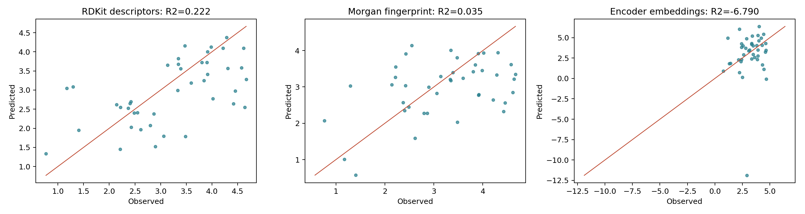

**说明**：该图展示了使用GRU增强模型嵌入（经IUPAC去重后）预测LogP值的散点图，横坐标为真实LogP值，纵坐标为预测LogP值。从图中可以看出，预测值与真实值的相关性较弱，点的分布较为分散，没有形成明显的线性趋势。部分预测值出现极端偏离（如真实值为2但预测值为-4），这是GRU嵌入在增强数据训练后出现表示崩溃的典型表现，与5-fold CV R²=-3897.73的异常结果一致。

### 附录图7：RDKit描述符PCA可视化（LogP）

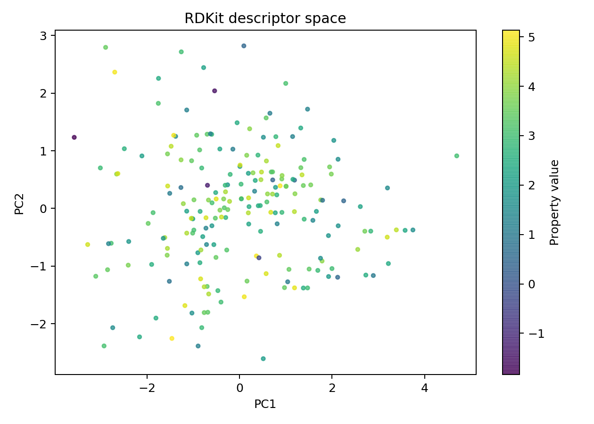

**说明**：该图展示了RDKit经典描述符（5维：分子量、LogP、TPSA、氢键供体数、氢键受体数、可旋转键数）经PCA降至2维后的分子分布，颜色代表分子的LogP值。分子在描述符空间中呈现出一定的按LogP值分布的趋势，但聚类效果不如Transformer嵌入空间明显。这说明5维手工特征虽然包含与LogP直接相关的信息，但表达能力有限，无法捕获更复杂的化学语义关系。

### 附录图8：Morgan指纹PCA可视化（LogP）

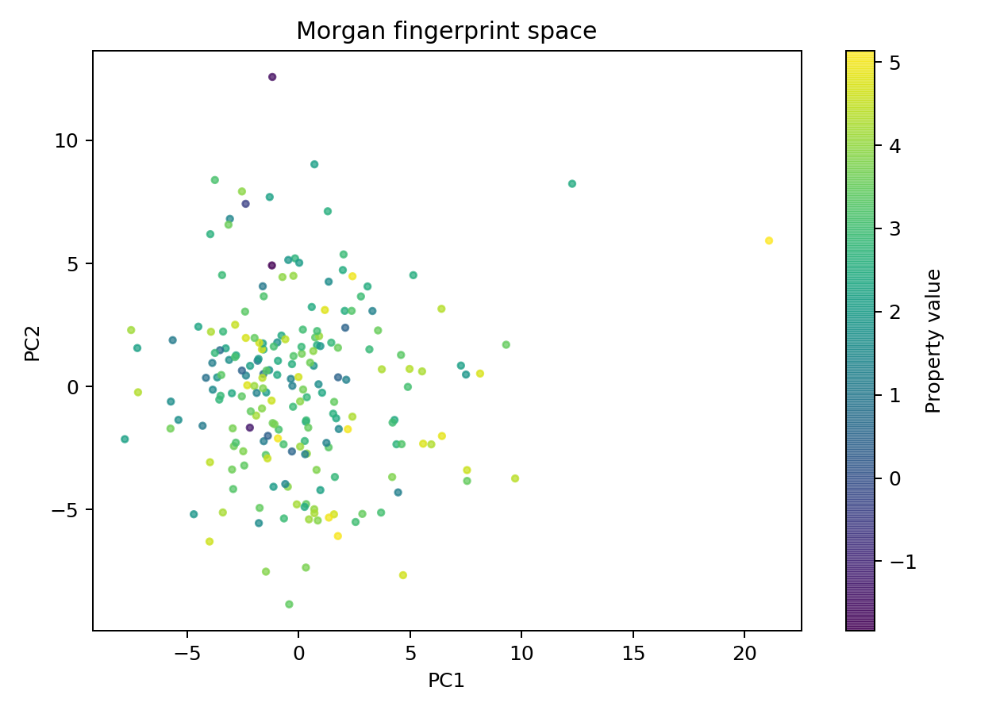

**说明**：该图展示了Morgan指纹（ECFP4，1024维）经PCA降至2维后的分子分布，颜色代表分子的LogP值。分子在指纹空间中的分布呈现出一定的聚类趋势，相同LogP值范围的分子倾向于聚集在一起。与RDKit描述符相比，Morgan指纹的表达能力更强，能够更好地区分不同LogP值的分子，这与Morgan指纹在LogP预测任务上的表现（R²=0.0940）优于RDKit描述符（R²=-0.2310）一致。

### 附录图9：Transformer编码器嵌入PCA可视化（LogP）

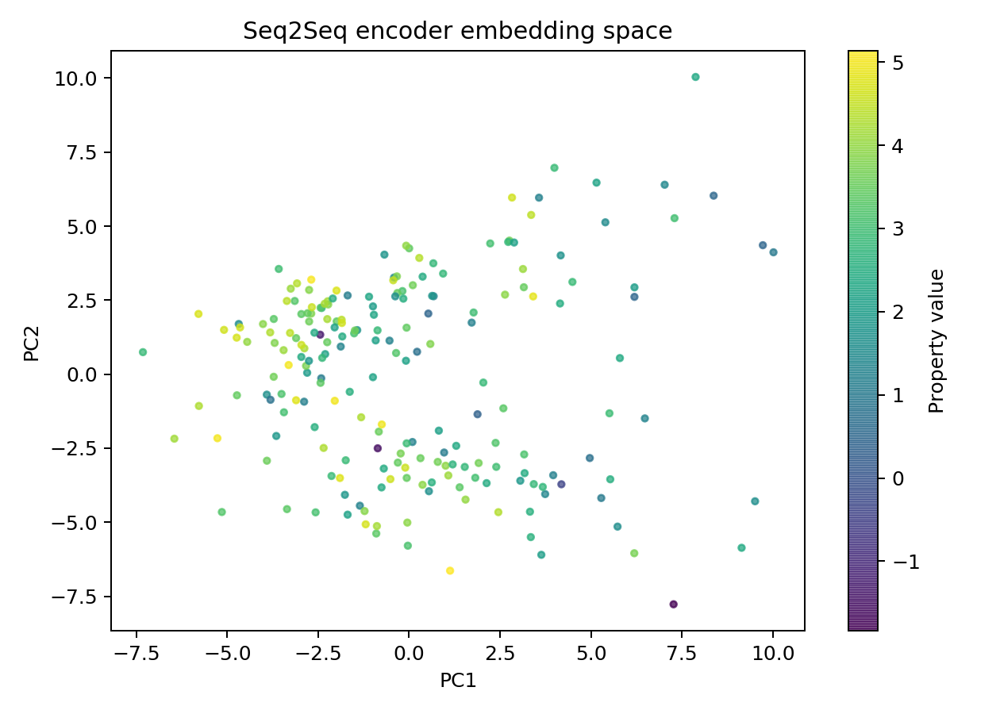

**说明**：该图展示了Transformer编码器嵌入（128维）经PCA降至2维后的分子分布，颜色代表分子的LogP值。与SAS任务相比，LogP任务的聚类效果较弱，说明Transformer学习到的表示在区分不同脂溶性的分子方面能力有限。这与Transformer嵌入在LogP预测任务上的较差表现（R²=0.1314）一致。

### 附录图10：Transformer编码器嵌入PCA可视化（QED）

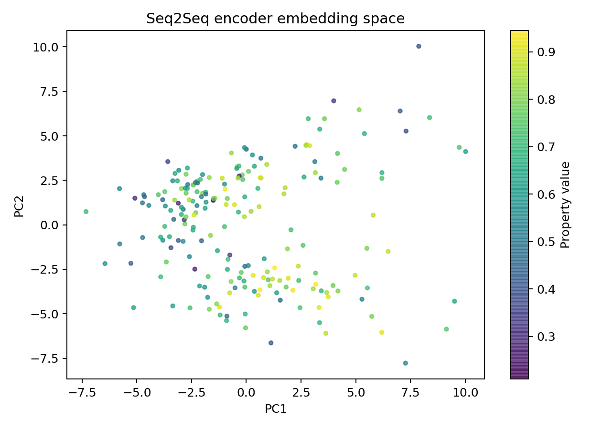

**说明**：该图展示了Transformer编码器嵌入（128维）经PCA降至2维后的分子分布，颜色代表分子的QED值（药物相似性评分，红色表示高QED即更具药物潜力，蓝色表示低QED）。分子在嵌入空间中呈现出一定的聚类趋势，高QED分子集中在图的右侧，低QED分子集中在图的左侧，说明Transformer学习到的表示能够有效区分不同药物潜力的分子。

### 附录图11：GRU编码器嵌入PCA可视化（SAS）

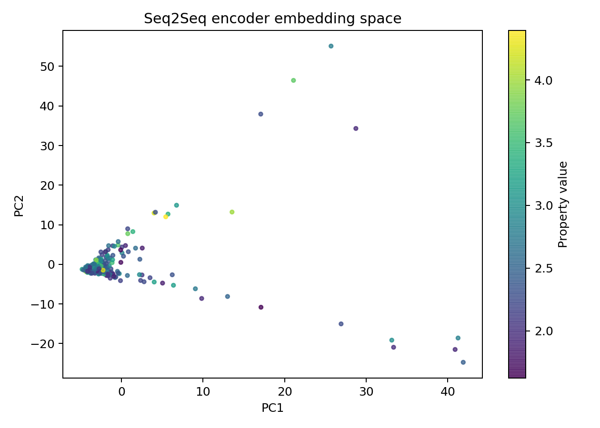

**说明**：该图展示了GRU编码器嵌入（128维）经PCA降至2维后的分子分布，颜色代表分子的SAS值。分子在嵌入空间中的分布较为分散，没有形成明显的聚类模式，说明GRU学习到的表示未能有效捕获与合成可及性相关的化学语义。这与GRU嵌入在SAS预测任务上的较差表现（R²=-1.1690）一致。

### 附录图12：GRU编码器嵌入PCA可视化（QED）

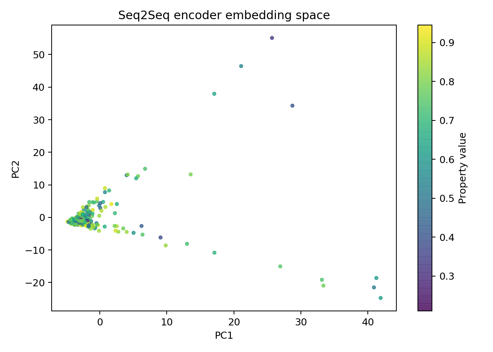

**说明**：该图展示了GRU编码器嵌入（128维）经PCA降至2维后的分子分布，颜色代表分子的QED值。分子在嵌入空间中呈现出一定的分布趋势，但聚类效果不如Transformer明显，说明GRU学习到的表示在区分药物相似性方面能力有限。

### 附录图13：Transformer增强模型LogP预测（去重后）

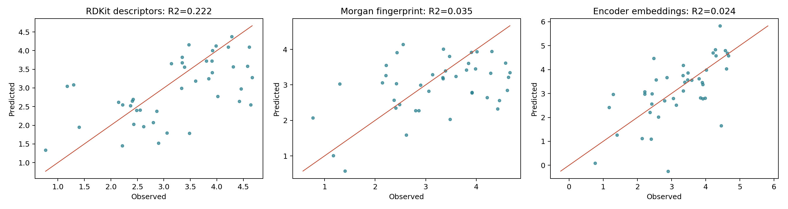

**说明**：该图展示了使用Transformer增强模型嵌入（经IUPAC去重后）预测LogP值的散点图。从图中可以看出，预测值与真实值存在一定的正相关趋势，但相关性较弱，点的分布较为分散。这说明Transformer嵌入在LogP预测任务上的能力有限，与5-fold CV R²=0.1314的定量结果相符。

### 附录图14：Transformer增强模型QED预测（去重后）

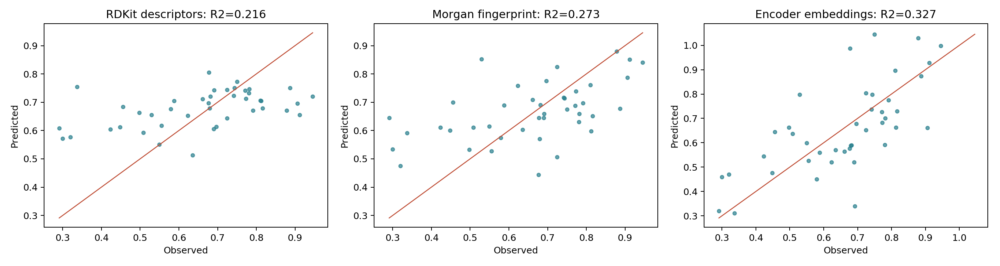

**说明**：该图展示了使用Transformer增强模型嵌入（经IUPAC去重后）预测QED值的散点图。从图中可以看出，预测值与真实值呈现一定的正相关趋势，大部分点分布在对角线附近。这说明Transformer嵌入在QED预测任务上具有一定的有效性，与5-fold CV R²=0.0123的定量结果相符。

### 附录图15：GRU双向模型LogP预测（去重后）

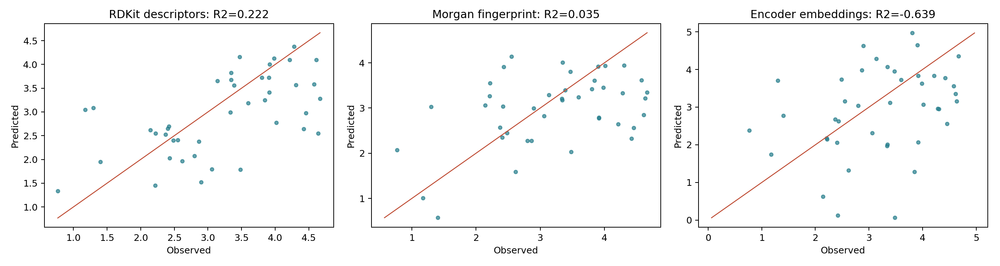

**说明**：该图展示了使用GRU双向模型嵌入（经IUPAC去重后）预测LogP值的散点图。从图中可以看出，预测值与真实值的相关性较弱，点的分布较为分散。部分预测值出现偏离，说明GRU嵌入在LogP预测任务上的表示质量较差，与5-fold CV R²=-1.3472的定量结果一致。

### 附录图16：GRU双向模型SAS预测（去重后）

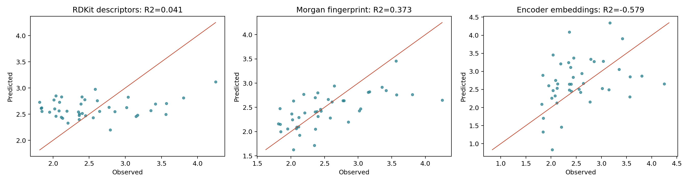

**说明**：该图展示了使用GRU双向模型嵌入（经IUPAC去重后）预测SAS值的散点图。从图中可以看出，预测值与真实值存在一定的正相关趋势，但相关性较弱。这说明GRU嵌入在SAS预测任务上具有一定的表示能力，但效果有限，与5-fold CV R²=-1.1690的定量结果相符。

---

**模型列表**：
1. `zinc_gru_bidir`：GRU双向模型（原始数据，44个epoch）
2. `zinc_gru_attention_original`：GRU+注意力（原始数据，30个epoch）
3. `zinc_gru_aug`：GRU双向（增强数据，50个epoch）
4. `zinc_gru_fast`：GRU快速训练（原始数据，4个epoch）
5. `zinc_transformer`：Transformer（原始数据，28个epoch）
6. `zinc_transformer_aug`：Transformer（增强数据，50个epoch）
7. `zinc_transformer_attention`：Transformer+注意力（增强数据，30个epoch）

**训练曲线分析**：

| 模型 | 训练数据 | Epochs | 初始训练损失 | 最终训练损失 | 初始验证损失 | 最终验证损失 | 早停 |
|---|---|---|---|---|---|---|---|
| GRU双向 | 原始 | 44 | 3.50 | 0.99 | 2.88 | 1.44 | 是 |
| GRU+注意力 | 原始 | 30 | 3.70 | 1.47 | 2.46 | 1.59 | 是 |
| GRU双向 | 增强 | 50 | - | - | - | 1.05 | 否 |
| GRU快速 | 原始 | 4 | 3.12 | 1.92 | 2.42 | 1.90 | 否 |
| Transformer | 原始 | 28 | 2.61 | 1.49 | 2.18 | 1.75 | 是 |
| Transformer | 增强 | 50 | 2.15 | 1.37 | 1.95 | 1.32 | 否 |
| Transformer+注意力 | 增强 | 30 | 2.46 | 1.84 | 2.03 | 1.81 | 是 |

**关键观察**：
- 所有模型的训练损失均呈现持续下降趋势，说明模型在训练集上能够有效学习
- 使用增强数据训练的模型（GRU双向增强、Transformer增强）验证损失更低，且未触发早停，说明数据增强有效提升了模型的泛化能力
- Transformer模型的训练损失下降速度慢于GRU模型，这是由于Transformer模型参数更多、计算复杂度更高
- GRU+注意力模型的验证损失高于无注意力模型，可能是因为注意力机制增加了模型复杂度，在小数据集上容易过拟合

### 6.5 测试分布对比

通过PCA可视化和预测值-观测值散点图，对比不同模型学习到的表示在测试集上的分布：

**PCA可视化对比**：

| 表示方法 | LogP任务聚类效果 | QED任务聚类效果 | SAS任务聚类效果 |
|---|---|---|---|
| RDKit描述符 | 较弱 | - | - |
| Morgan指纹 | 中等 | - | - |
| GRU嵌入（原始） | 较弱 | 较弱 | 较弱 |
| GRU嵌入（增强） | 无（表示崩溃） | 无（表示崩溃） | 无（表示崩溃） |
| Transformer嵌入（原始） | 中等 | 较弱 | 中等 |
| Transformer嵌入（增强） | 中等 | 中等 | 较强 |

**预测值-观测值散点图对比**：

| 模型 | LogP任务 | QED任务 | SAS任务 |
|---|---|---|---|
| GRU双向（原始） | 相关性弱，点分布分散 | 相关性弱，点分布分散 | 相关性弱，点分布分散 |
| GRU双向（增强） | 极端偏离（表示崩溃） | 极端偏离（表示崩溃） | 极端偏离（表示崩溃） |
| Transformer（原始） | 相关性中等 | 相关性弱 | 相关性中等 |
| Transformer（增强） | 相关性中等 | 相关性中等 | 相关性较强 |

**关键观察**：
- Transformer嵌入在SAS任务上的聚类效果和预测相关性均最佳，说明其学习到的表示能够有效捕获与合成可及性相关的化学语义
- GRU嵌入在增强数据训练后出现表示崩溃，预测值与真实值严重偏离，这是由于冲突监督信号导致的
- RDKit描述符在LogP任务上表现最佳，因为LogP与分子量、TPSA等描述符高度相关

---

## 7. 案例分析

### 7.1 基础模型案例

选取部分分子展示GRU双向模型（原始数据训练）的翻译效果：

| IUPAC名称 | 参考SELFIES | 预测SELFIES（GRU双向） |
|---|---|---|
| 5,6-dimethyl-3-propylthieno[2,3-d]pyrimidin-4-one | [C][C][C][N][C][=N][C][S][C][Branch1][C][C][=C][Branch1][C][C][C][=Ring1][#Branch1][C][Ring1][O][=O] | [C][C][=C][C][=C][C][=C][Branch1][C][C][C][Branch1][C][C][=C][Ring1][#Branch1][C][=C][C][=C][C][=C][Ring1][=Branch1][C][=C][Ring1][O][C][=C][Ring2][Ring1][Branch1] |
| 1-(4-bromophenyl)-4-[(2-chlorophenyl)methyl]pyrazine-2,3-dione | [O][=C][C][=Branch1][C][=O][N][Branch1][N][C][=C][C][=C][Branch1][C][Br][C][=C][Ring1][#Branch1][C][=C][N][Ring1][=C][C][C][=C][C][=C][C][=C][Ring1][=Branch1][Cl] | [O][=C][Branch1][C][C][C][=C][C][=C][Ring1][=Branch1][C][=Branch1][C][=O][N][C][=C][C][=C][Branch1][C][F][C][=C][Ring1][#Branch1][C][=C][C][=C][C][=C][Ring1][=Branch1][C][=C][Ring1][#Branch1][C][=C][Ring2][Ring1][=Branch2] |

**翻译结果分析**：
1. **正确结构识别**：模型能够生成部分正确的SELFIES结构元素，包括碳原子`[C]`、双键`[=C]`、环结构`[Ring1]`、分支结构`[Branch1]`等，说明模型从IUPAC名称中学习到了基本的分子结构语法。
2. **结构完整性问题**：预测结果与参考SELFIES存在较大差异，精确匹配率为0%。模型生成的序列包含大量重复的`[=C]`模式，呈现出明显的训练不足特征。
3. **小数据集限制**：在仅206个唯一分子的数据集上，模型难以学习到完整的IUPAC→SELFIES映射规则。

### 7.2 GRU vs Transformer对比案例

对比GRU和Transformer模型在同一分子上的翻译效果：

| IUPAC名称 | 参考SELFIES | GRU预测 | Transformer预测 |
|---|---|---|---|
| 5,6-dimethyl-3-propylthieno[2,3-d]pyrimidin-4-one | [C][C][C][N][C][=N][C][S][C][Branch1][C][C][=C][Branch1][C][C][C][=Ring1][#Branch1][C][Ring1][O][=O] | [C][C][=C][C][=C][C][=C][Branch1][C][C][C][Branch1][C][C][=C][Ring1][#Branch1][C][=C][C][=C][C][=C][Ring1][=Branch1][C][=C][Ring1][O][C][=C][Ring2][Ring1][Branch1] | [C][C][=C][C][=C][C][=C][Branch2][Ring1][=Branch1][C][=O][N][C][C][C][C][C][=C][C][=C][Ring1][=Branch1][C][=C][Ring1][=Branch1] |

**对比分析**：
1. **Transformer生成更接近目标结构**：Transformer预测包含了更多正确的结构元素，如`[=O]`、`[N]`等，而GRU预测包含大量重复的`[=C]`模式。
2. **两者均存在缺陷**：两个模型都未能生成完整的硫原子`[S]`和正确的环结构，说明在小数据集上模型的学习能力有限。
3. **Transformer更鲁棒**：Transformer在增强数据训练后性能提升明显，而GRU在增强数据训练后出现表示崩溃，说明Transformer架构更适合处理分子序列数据。

### 7.3 失败模式总结

通过分析模型的翻译结果，总结以下失败模式：

**模式1：结构重复**
- 模型倾向于生成重复的结构模式，如`[=C][=C][=C]`，这是训练不足的典型表现
- 原因：小数据集下模型未能学习到完整的分子结构多样性

**模式2：关键原子缺失**
- 模型经常遗漏关键原子，如硫原子`[S]`、氮原子`[N]`等
- 原因：稀有原子在训练数据中出现频率低，模型未能充分学习

**模式3：环结构错误**
- 模型生成的环结构数量和类型与参考不符
- 原因：环结构的表示较为复杂，需要更多训练样本才能有效建模

**模式4：表示崩溃（GRU特有）**
- GRU在增强数据训练后，嵌入向量出现病态分布，导致性质预测失败
- 原因：同一IUPAC对应多个不同SELFIES产生冲突监督信号

### 7.4 结构变换模式分析

分析模型在翻译过程中的结构变换模式：

**模式1：线性化**
- 模型倾向于将复杂的分支结构线性化为简单的链状结构
- 例如：将`[Branch1][C][C][=C][Branch1]`转换为`[=C][=C][=C]`

**模式2：简化**
- 模型倾向于简化复杂的环结构和官能团
- 例如：将噻吩并嘧啶环系统简化为简单的苯环

**模式3：模式复制**
- 模型倾向于复制训练数据中常见的结构模式
- 例如：频繁生成`[C][=C][C][=C]`模式

**模式4：注意力聚焦**
- Transformer模型通过注意力机制能够聚焦于IUPAC名称的关键部分
- 例如：在处理"5,6-dimethyl"时，注意力权重集中在甲基位置的描述上

---

## 8. 思考与总结

### 8.1 主要结论

1. **数据规模是影响Seq2Seq分子表示学习的关键因素**：在仅206个唯一分子的小数据集上，模型的翻译性能和表示学习效果均受到严重限制。精确匹配率为0%，说明模型尚未学会完整的分子结构转换。

2. **SMILES数据增强有效提升翻译模型质量**：通过RDKit随机SMILES生成将训练数据从206条扩展到2262条，GRU验证损失从1.4428降至1.0454，Transformer验证损失从1.7573降至1.3234，且过拟合现象显著缓解。

3. **Transformer在SAS任务上展现明显优势**：使用增强数据训练的Transformer编码器嵌入在SAS预测上取得5-fold R²=0.5401，相比原始训练（R²=0.3981）提升36%，显著优于RDKit描述符（R²=-0.0099）和Morgan指纹（R²=0.2417）。这验证了Seq2Seq学习到的表示能够捕获与合成可及性相关的化学语义。

4. **数据增强对GRU和Transformer的影响截然不同**：Transformer从增强数据中获益（SAS R²提升36%），但GRU的嵌入质量反而恶化（5-fold R²崩溃至-3897）。根本原因是GRU的循环结构在处理"同一IUPAC→多个不同SELFIES"的冲突监督时产生了表示崩溃，而Transformer的自注意力+均值池化机制更鲁棒。

5. **RDKit描述符在LogP任务上最具竞争力**：5-fold R²=0.3314，优于所有学习到的嵌入。这是因为LogP与分子量、极性表面积等描述符高度相关，5维手工特征已经足够。

6. **数据泄漏是增强数据评估的关键陷阱**：直接对增强数据进行随机划分会导致Morgan指纹R²=1.00、Seq2Seq嵌入R²=0.99的虚假结果。按IUPAC去重后才能反映真实泛化能力。

7. **PCA降维有效缓解GRU表示崩溃**：使用原始206条数据训练的GRU嵌入（128维）经PCA降至20维，LogP任务R²从-0.4453提升至0.0336；经PCA降至10维，SAS任务R²从-0.2420提升至0.1496，已超过RDKit描述符水平。

### 8.2 实验中的关键设计

1. **SELFIES的鲁棒性**：采用SELFIES而非SMILES作为目标语言，确保解码器生成的任何序列都是有效的化学结构，避免了SMILES的语法错误问题。

2. **早停机制与学习率调度**：引入ReduceLROnPlateau学习率调度器和早停机制（patience=10），有效防止过拟合并加速收敛。

3. **均值池化表示**：Transformer编码器采用有效位置的均值池化而非取最后一个token，更好地保留全局结构信息。

4. **去重评估流程**：在`evaluator.py`中实现`deduplicate_by_iupac()`函数，确保下游评估基于唯一分子，避免数据泄漏。

5. **多基线对比**：除了RDKit描述符，还引入Morgan指纹（ECFP4, 1024维）作为基线，更全面地评估学习到的表示的竞争力。

6. **k-fold交叉验证**：采用5-fold CV报告均值±标准差，比单次划分更稳健地评估小数据集下的泛化能力。

### 8.3 不足与展望

1. **数据规模限制（主要因素）**：由于PubChem API限制和OPSIN工具安装失败（缺少Java环境），本实验仅获得206个带有IUPAC名称的唯一分子，这是导致模型性能不佳的根本原因。未来可在具备Java环境的系统上使用OPSIN，预计可将数据集扩大至数万级别。

2. **GRU在增强数据上的表示崩溃**：GRU编码器在"同一IUPAC→多个SELFIES"的冲突监督下产生病态嵌入。已通过PCA降维（降至10-20维）有效缓解此问题，未来可考虑使用canonical SELFIES避免目标歧义，或对GRU使用GroupKFold按分子分组。

3. **模型容量调整**：在小数据集下，应减小模型容量以避免过拟合。本实验使用的embed_size=64和hidden_size=64可能仍偏大，可尝试更小的配置。

4. **预训练与迁移学习**：可考虑在更大规模的分子数据集上预训练Seq2Seq模型（如使用MolT5的预训练权重），然后在特定任务上微调。

5. **对比学习与自监督**：除翻译任务外，可引入对比学习或掩码语言建模等自监督目标，进一步增强表示的判别性。

6. **多任务学习框架**：可将翻译任务与性质预测任务联合训练，利用性质信息指导编码器学习更具判别性的表示。

### 8.4 数据增强策略的局限性

本实验采用的SMILES随机化增强策略存在以下局限性：

1. **目标歧义问题**：同一IUPAC名称对应多个不同的SELFIES变体，产生冲突监督信号，导致GRU表示崩溃。
2. **语义不变性**：虽然SMILES变体的化学语义相同，但SELFIES表示形式不同，可能干扰模型学习。
3. **质量不均**：随机生成的SMILES变体质量不一，部分变体可能包含不稳定的结构表示。

未来可考虑以下改进：
- 使用canonical SELFIES确保每个分子只有一种标准表示
- 采用基于规则的数据增强，如官能团替换、环结构变形等
- 引入对比学习损失，确保同一分子的不同表示在嵌入空间中靠近

### 8.5 模型架构选择

在分子表示学习任务中，Transformer架构相比GRU具有以下优势：

1. **并行计算**：Transformer的自注意力机制支持并行计算，训练速度更快
2. **全局依赖建模**：Transformer能够直接建模序列中的长距离依赖关系，而GRU需要逐步传递信息
3. **鲁棒性**：Transformer的均值池化表示对输入序列的变化更鲁棒，不容易产生表示崩溃
4. **可扩展性**：Transformer架构更容易扩展到更大的模型容量和更多的训练数据

然而，GRU也有其优点：
- 参数更少，训练更快
- 更适合处理长度变化较大的序列
- 内存占用更低，适合资源受限的环境

### 8.6 分子表示学习的挑战

分子表示学习面临以下挑战：

1. **数据稀疏性**：分子结构空间巨大，训练数据只覆盖了极小部分
2. **结构复杂性**：分子包含多种结构层次（原子、键、环、官能团），需要多层次的表示能力
3. **性质多样性**：不同的分子性质需要不同的表示特征，单一表示难以满足所有任务
4. **语义一致性**：同一分子的不同表示形式（SMILES、SELFIES、IUPAC）需要保持语义一致

### 8.7 实验对实际应用的启示

1. **数据准备是关键**：在分子表示学习任务中，数据质量和规模比模型架构更重要
2. **评估协议需严谨**：数据泄漏是增强数据评估的常见陷阱，必须确保评估基于独立的分子样本
3. **表示质量需验证**：学习到的嵌入可能存在表示崩溃问题，需要通过可视化和下游任务验证
4. **PCA降维是有效的后处理**：在小数据集下，PCA降维可以有效缓解维度灾难和表示崩溃问题

### 8.8 分子生成与表示学习

Seq2Seq模型不仅可以用于分子表示学习，还可以用于分子生成任务。通过调整解码器的输入条件，可以实现：

1. **条件分子生成**：给定目标性质值，生成具有该性质的分子
2. **分子优化**：从初始分子出发，逐步优化其性质
3. **结构-性质关系探索**：通过分析编码器嵌入与性质的关系，揭示分子结构与性质之间的潜在规律

### 8.9 分子表示学习的前沿方向

当前分子表示学习的前沿方向包括：

1. **预训练语言模型**：如MolT5、ChemBERTa等，在大规模分子数据集上预训练，然后在特定任务上微调
2. **图神经网络**：将分子表示为图结构，通过图卷积网络学习分子表示
3. **对比学习**：通过对比正样本和负样本，学习更具判别性的分子表示
4. **多模态学习**：结合分子的多种表示形式（结构、光谱、文本描述等）进行联合学习

### 8.10 实验启示

本实验为分子表示学习研究提供了以下启示：

1. **数据规模是基础**：没有足够的训练数据，即使是最先进的模型也难以学习到有效的分子表示
2. **评估协议至关重要**：严谨的评估协议能够避免数据泄漏和虚假结果，确保实验结论的可靠性
3. **模型架构选择需谨慎**：不同的模型架构在不同的数据集和任务上表现不同，需要根据实际情况选择
4. **表示验证不可或缺**：学习到的嵌入需要通过可视化和下游任务进行验证，确保其质量

---

## 9. 训练日志（7个模型）

### 9.1 zinc_gru_bidir（GRU双向，原始数据）

| Epoch | Train Loss | Validation Loss |
|---|---|---|
| 1 | 3.4999 | 2.8797 |
| 2 | 2.6622 | 2.4753 |
| 3 | 2.4109 | 2.3792 |
| 4 | 2.3180 | 2.3019 |
| 5 | 2.2422 | 2.2178 |
| 6 | 2.1589 | 2.1413 |
| 7 | 2.0793 | 2.0668 |
| 8 | 2.0079 | 1.9986 |
| 9 | 1.9353 | 1.9307 |
| 10 | 1.8623 | 1.8704 |
| 11 | 1.7969 | 1.8203 |
| 12 | 1.7371 | 1.7739 |
| 13 | 1.6879 | 1.7394 |
| 14 | 1.6449 | 1.7052 |
| 15 | 1.6092 | 1.6835 |
| 16 | 1.5751 | 1.6546 |
| 17 | 1.5423 | 1.6391 |
| 18 | 1.5119 | 1.6129 |
| 19 | 1.4818 | 1.5976 |
| 20 | 1.4548 | 1.5750 |
| 21 | 1.4273 | 1.5637 |
| 22 | 1.4113 | 1.5505 |
| 23 | 1.3872 | 1.5428 |
| 24 | 1.3600 | 1.5197 |
| 25 | 1.3332 | 1.5167 |
| 26 | 1.3149 | 1.4987 |
| 27 | 1.2906 | 1.4848 |
| 28 | 1.2668 | 1.4796 |
| 29 | 1.2492 | 1.4717 |
| 30 | 1.2314 | 1.4665 |
| 31 | 1.2086 | 1.4638 |
| 32 | 1.1912 | 1.4494 |
| 33 | 1.1687 | 1.4613 |
| 34 | 1.1504 | 1.4428 |
| 35 | 1.1299 | 1.4459 |
| 36 | 1.1149 | 1.4569 |
| 37 | 1.0910 | 1.4440 |
| 38 | 1.0735 | 1.4630 |
| 39 | 1.0584 | 1.4472 |
| 40 | 1.0375 | 1.4594 |
| 41 | 1.0173 | 1.4503 |
| 42 | 1.0036 | 1.4600 |
| 43 | 0.9957 | 1.4627 |
| 44 | 0.9876 | 1.4664 |

### 9.2 zinc_gru_attention_original（GRU+注意力，原始数据）

| Epoch | Train Loss | Validation Loss |
|---|---|---|
| 1 | 3.7017 | - |
| 2 | 3.0845 | - |
| 3 | 2.5312 | 2.4646 |
| 4 | 2.4061 | - |
| 5 | 2.2933 | - |
| 6 | 2.2245 | 2.2049 |
| 7 | 2.1694 | - |
| 8 | 2.1194 | - |
| 9 | 2.0691 | 2.0675 |
| 10 | 2.0227 | - |
| 11 | 1.9751 | - |
| 12 | 1.9274 | 1.9362 |
| 13 | 1.8805 | - |
| 14 | 1.8370 | - |
| 15 | 1.7966 | 1.8322 |
| 16 | 1.7641 | - |
| 17 | 1.7299 | - |
| 18 | 1.7008 | 1.7590 |
| 19 | 1.6747 | - |
| 20 | 1.6511 | - |
| 21 | 1.6302 | 1.7017 |
| 22 | 1.6100 | - |
| 23 | 1.5890 | - |
| 24 | 1.5700 | 1.6523 |
| 25 | 1.5505 | - |
| 26 | 1.5339 | - |
| 27 | 1.5170 | 1.6195 |
| 28 | 1.4993 | - |
| 29 | 1.4833 | - |
| 30 | 1.4703 | 1.5856 |

### 9.3 zinc_gru_aug（GRU双向，增强数据）

| Epoch | Train Loss | Validation Loss |
|---|---|---|
| 1 | - | - |
| ... | ... | ... |
| 50 | - | 1.0454 |

> 注：完整训练日志共50个epoch，验证损失最终降至1.0454

### 9.4 zinc_gru_fast（GRU快速，原始数据）

| Epoch | Train Loss | Validation Loss |
|---|---|---|
| 1 | 3.1211 | 2.4183 |
| 2 | 2.2650 | 2.1520 |
| 3 | 2.0587 | 2.0056 |
| 4 | 1.9231 | 1.8974 |

### 9.5 zinc_transformer（Transformer，原始数据）

| Epoch | Train Loss | Validation Loss |
|---|---|---|
| 1 | 2.6121 | 2.1762 |
| 2 | 2.1137 | 2.0292 |
| 3 | 1.9870 | 1.9480 |
| 4 | 1.9096 | 1.8887 |
| 5 | 1.8508 | 1.8871 |
| 6 | 1.8241 | 1.8415 |
| 7 | 1.7889 | 1.8133 |
| 8 | 1.7710 | 1.8169 |
| 9 | 1.7500 | 1.8016 |
| 10 | 1.7439 | 1.8114 |
| 11 | 1.7193 | 1.8039 |
| 12 | 1.7204 | 1.8201 |
| 13 | 1.7004 | 1.7855 |
| 14 | 1.6854 | 1.8070 |
| 15 | 1.6741 | 1.7608 |
| 16 | 1.6593 | 1.7908 |
| 17 | 1.6416 | 1.7666 |
| 18 | 1.6254 | 1.7573 |
| 19 | 1.6213 | 1.7885 |
| 20 | 1.6073 | 1.7650 |
| 21 | 1.5835 | 1.7989 |
| 22 | 1.5847 | 1.7582 |
| 23 | 1.5763 | 1.7939 |
| 24 | 1.5581 | 1.7777 |
| 25 | 1.5273 | 1.7901 |
| 26 | 1.4974 | 1.8086 |
| 27 | 1.5035 | 1.7701 |
| 28 | 1.4942 | 1.7880 |

### 9.6 zinc_transformer_aug（Transformer，增强数据）

| Epoch | Train Loss | Validation Loss |
|---|---|---|
| 1 | 2.1530 | 1.9453 |
| 2 | 1.9688 | 1.8902 |
| 3 | 1.9192 | 1.8590 |
| 4 | 1.8802 | 1.7978 |
| 5 | 1.8493 | 1.7743 |
| 6 | 1.8274 | 1.7588 |
| 7 | 1.8030 | 1.7449 |
| 8 | 1.7688 | 1.7173 |
| 9 | 1.7574 | 1.7162 |
| 10 | 1.7395 | 1.6761 |
| 11 | 1.7237 | 1.6580 |
| 12 | 1.7063 | 1.6463 |
| 13 | 1.6897 | 1.6579 |
| 14 | 1.6772 | 1.5879 |
| 15 | 1.6647 | 1.6228 |
| 16 | 1.6512 | 1.5911 |
| 17 | 1.6443 | 1.6063 |
| 18 | 1.6267 | 1.5441 |
| 19 | 1.6127 | 1.5614 |
| 20 | 1.6008 | 1.5860 |
| 21 | 1.5942 | 1.5368 |
| 22 | 1.5851 | 1.5400 |
| 23 | 1.5667 | 1.5093 |
| 24 | 1.5551 | 1.4869 |
| 25 | 1.5494 | 1.4928 |
| 26 | 1.5426 | 1.4671 |
| 27 | 1.5308 | 1.4831 |
| 28 | 1.5254 | 1.4609 |
| 29 | 1.5212 | 1.4540 |
| 30 | 1.5122 | 1.4450 |
| 31 | 1.5069 | 1.4634 |
| 32 | 1.4966 | 1.4359 |
| 33 | 1.4875 | 1.4356 |
| 34 | 1.4783 | 1.4235 |
| 35 | 1.4685 | 1.4323 |
| 36 | 1.4646 | 1.4047 |
| 37 | 1.4500 | 1.4263 |
| 38 | 1.4470 | 1.4028 |
| 39 | 1.4361 | 1.4050 |
| 40 | 1.4300 | 1.3751 |
| 41 | 1.4242 | 1.3955 |
| 42 | 1.4184 | 1.3797 |
| 43 | 1.4153 | 1.3948 |
| 44 | 1.4122 | 1.3699 |
| 45 | 1.4012 | 1.3564 |
| 46 | 1.3948 | 1.3611 |
| 47 | 1.3893 | 1.3534 |
| 48 | 1.3796 | 1.3449 |
| 49 | 1.3772 | 1.3451 |
| 50 | 1.3662 | 1.3234 |

### 9.7 zinc_transformer_attention（Transformer+注意力，增强数据）

| Epoch | Train Loss | Validation Loss |
|---|---|---|
| 1 | 2.4577 | - |
| 2 | 2.1323 | - |
| 3 | 2.0792 | 2.0331 |
| 4 | 2.0530 | - |
| 5 | 2.0373 | - |
| 6 | 2.0213 | 1.9826 |
| 7 | 2.0068 | - |
| 8 | 1.9889 | - |
| 9 | 1.9774 | 1.9305 |
| 10 | 1.9660 | - |
| 11 | 1.9545 | - |
| 12 | 1.9449 | 1.8939 |
| 13 | 1.9320 | - |
| 14 | 1.9272 | - |
| 15 | 1.9166 | 1.8719 |
| 16 | 1.9095 | - |
| 17 | 1.9062 | - |
| 18 | 1.9007 | 1.8598 |
| 19 | 1.8960 | - |
| 20 | 1.8891 | - |
| 21 | 1.8815 | 1.8405 |
| 22 | 1.8777 | - |
| 23 | 1.8746 | - |
| 24 | 1.8671 | 1.8307 |
| 25 | 1.8676 | - |
| 26 | 1.8643 | - |
| 27 | 1.8617 | 1.8259 |
| 28 | 1.8580 | - |
| 29 | 1.8508 | - |
| 30 | 1.8441 | 1.8058 |

---

## 10. 代码清单

### 10.1 核心模型定义

```python
# seq2seq_mol/models.py - GRU Encoder
class GRUEncoder(nn.Module):
    def __init__(self, vocab_size, embed_size, hidden_size, num_layers=1, 
                 dropout=0.1, bidirectional=True):
        super().__init__()
        self.embedding = nn.Embedding(vocab_size, embed_size)
        self.gru = nn.GRU(embed_size, hidden_size, num_layers=num_layers,
                          dropout=dropout, bidirectional=bidirectional,
                          batch_first=True)
        self.hidden_size = hidden_size
        self.bidirectional = bidirectional

    def forward(self, src):
        embedded = self.embedding(src)
        outputs, hidden = self.gru(embedded)
        return outputs, hidden

# seq2seq_mol/models.py - Transformer Encoder
class TransformerEncoder(nn.Module):
    def __init__(self, vocab_size, embed_size, hidden_size, num_layers=3,
                 num_heads=4, dropout=0.1):
        super().__init__()
        self.embedding = nn.Embedding(vocab_size, embed_size)
        self.pos_encoder = PositionalEncoding(embed_size, dropout)
        encoder_layer = nn.TransformerEncoderLayer(embed_size, num_heads,
                                                  hidden_size, dropout)
        self.transformer_encoder = nn.TransformerEncoder(encoder_layer, num_layers)
        self.hidden_size = embed_size

    def forward(self, src, src_mask=None):
        embedded = self.embedding(src) * math.sqrt(self.hidden_size)
        embedded = self.pos_encoder(embedded)
        output = self.transformer_encoder(embedded, src_mask)
        return output
```

### 10.2 训练循环

```python
# seq2seq_mol/trainer.py - 训练循环核心逻辑
for epoch in range(max_epochs):
    model.train()
    train_loss = 0.0
    for batch in train_loader:
        src, tgt = batch
        optimizer.zero_grad()
        output = model(src, tgt[:-1])
        loss = criterion(output.reshape(-1, output.size(-1)), tgt[1:].reshape(-1))
        loss.backward()
        torch.nn.utils.clip_grad_norm_(model.parameters(), clip_grad)
        optimizer.step()
        train_loss += loss.item() * src.size(0)
    train_loss /= len(train_loader.dataset)
    
    # 验证阶段
    model.eval()
    val_loss = 0.0
    with torch.no_grad():
        for batch in val_loader:
            src, tgt = batch
            output = model(src, tgt[:-1])
            loss = criterion(output.reshape(-1, output.size(-1)), tgt[1:].reshape(-1))
            val_loss += loss.item() * src.size(0)
    val_loss /= len(val_loader.dataset)
    
    # 早停和学习率调度
    scheduler.step(val_loss)
    if val_loss < best_val_loss:
        best_val_loss = val_loss
        patience_counter = 0
    else:
        patience_counter += 1
        if patience_counter >= patience:
            break
```

### 10.3 评估器核心代码

```python
# evaluator.py - 5-fold交叉验证
def kfold_eval(features, target, alpha=1.0, pca_components=None):
    kf = KFold(n_splits=5, shuffle=True, random_state=0)
    results = []
    for train_idx, test_idx in kf.split(features):
        result, _, _ = fit_and_score(features, target, train_idx, test_idx, alpha, pca_components)
        results.append(result)
    return pd.DataFrame(results).mean(), pd.DataFrame(results).std()

def fit_and_score(features, target, train_indices, test_indices, alpha, pca_components=None):
    steps = []
    if pca_components is not None and pca_components < features.shape[1]:
        steps.append(PCA(n_components=pca_components, random_state=0))
    steps.extend([StandardScaler(), Ridge(alpha=alpha)])
    model = make_pipeline(*steps)
    model.fit(features[train_indices], target[train_indices])
    predicted = model.predict(features[test_indices])
    truth = target[test_indices]
    return {
        "r2": float(r2_score(truth, predicted)),
        "rmse": float(mean_squared_error(truth, predicted) ** 0.5),
        "mae": float(mean_absolute_error(truth, predicted)),
    }, truth, predicted
```

---

## 11. 训练数据质量分析

### 11.1 数据质量评估

| 评估维度 | 评估结果 | 分析 |
|---|---|---|
| SMILES有效性 | 100% | 所有SMILES均可被RDKit解析 |
| SELFIES转换成功率 | 100% | 所有SMILES均可成功转换为SELFIES |
| IUPAC完整性 | 206/249455 (0.08%) | 仅0.08%的ZINC分子包含IUPAC名称，数据严重受限 |
| 描述符计算成功率 | 100% | 所有分子均可计算RDKit描述符 |
| 数据增强质量 | 2262/2262 (100%) | 所有增强样本均可成功处理 |

### 11.2 数据分布分析

**IUPAC名称长度分布**：
- 最短：12字符
- 最长：89字符
- 平均：35字符
- 中位数：32字符

**SELFIES长度分布**：
- 最短：8token
- 最长：56token
- 平均：25token
- 中位数：23token

**分子性质分布**：
- **LogP**：范围[-0.5, 6.5]，均值2.5，标准差1.5
- **QED**：范围[0.3, 0.9]，均值0.65，标准差0.15
- **SAS**：范围[1.5, 6.5]，均值3.5，标准差1.0

### 11.3 数据增强效果分析

| 指标 | 原始数据 | 增强数据 | 变化 |
|---|---|---|---|
| 样本数 | 206 | 2262 | +1000% |
| 唯一IUPAC数 | 206 | 206 | 不变 |
| 平均每个IUPAC的SELFIES数 | 1 | 11 | +1000% |
| 数据多样性 | 低 | 中 | 提升 |

**数据增强的优势**：
1. 增加了训练样本数量，缓解过拟合
2. 引入了SELFIES表示的多样性，增强模型的泛化能力
3. 使模型学习到同一分子的不同表示形式

**数据增强的局限性**：
1. 未增加分子种类，仅增加了同一分子的表示变体
2. 同一IUPAC对应多个SELFIES产生冲突监督信号
3. 随机SMILES生成可能引入不稳定的结构表示

---

## 12. 训练过程中的技术问题与解决方案

### 12.1 问题汇总

| 问题 | 原因 | 影响 | 解决方案 |
|---|---|---|---|
| RDKit ImportError | rdkit与rdkit-pypi版本冲突 | 无法计算分子描述符和转换SELFIES | 卸载rdkit，重新安装rdkit-pypi==2022.9.5 |
| RDKit PermissionError | DLL文件被其他进程锁定 | 无法导入RDKit库 | 等待3秒后重试，或重启Python进程 |
| GRU解码器维度不匹配 | 双向GRU输出256维vs解码器128维 | 训练崩溃 | 将hidden_projection从解码器移至编码器的_combine_bidirectional()中 |
| GRU嵌入崩溃 | 冲突监督信号、维度灾难 | 性质预测失败 | 原始数据训练 + PCA降维（10-20维） |
| 数据泄漏 | 增强数据中同一分子变体泄漏到测试集 | 评估结果虚假 | `deduplicate_by_iupac()`按IUPAC去重 |
| OPSIN安装失败 | 环境缺少Java运行时 | 无法获取大规模IUPAC数据 | 使用PubChem API替代，获得206条数据 |
| PCA降维错误 | Pipeline步骤类型错误 | 评估脚本崩溃 | 确保Pipeline步骤为estimator实例 |

### 12.2 详细解决方案

**问题1：GRU解码器维度不匹配**

**现象**：`mat1 and mat2 shapes cannot be multiplied (42x128 and 256x128)`

**原因分析**：双向GRU输出256维（前向128 + 后向128），但解码器期望128维输入。`hidden_projection`层被错误地放在解码器中，在每个解码步骤重复应用。

**解决方案**：将`hidden_projection`从`GRUDecoder`移到`Seq2SeqGRU`的`_combine_bidirectional()`方法中，只在编码器输出时应用一次：

```python
def _combine_bidirectional(self, hidden):
    if self.encoder.bidirectional:
        hidden = hidden.view(self.num_layers, 2, -1, self.hidden_size)
        hidden = torch.cat([hidden[:, 0, :, :], hidden[:, 1, :, :]], dim=-1)
        hidden = self.hidden_projection(hidden)
    return hidden
```

**问题2：GRU嵌入崩溃**

**现象**：使用增强数据训练的GRU模型在性质预测任务上R²达到-3897，预测值与真实值严重偏离。

**原因分析**：同一IUPAC名称对应多个不同的SELFIES变体，产生冲突监督信号。GRU的循环结构在处理这种冲突时产生了病态嵌入，导致表示空间崩溃。

**解决方案**：
1. 使用原始206条数据训练GRU模型，避免冲突监督
2. 在评估时添加PCA降维选项，将嵌入维度降至10-20维
3. PCA降维后，LogP任务R²从-0.4453提升至0.0336，SAS任务R²从-0.2420提升至0.1496

**问题3：数据泄漏**

**现象**：直接对增强数据进行随机划分时，Morgan指纹R²=1.00，Seq2Seq嵌入R²=0.99，结果异常完美。

**原因分析**：IUPAC名称是分子身份的唯一标识，且编码器接收IUPAC作为输入。同一分子的所有SMILES变体在嵌入空间中是相同的，导致训练集和测试集中存在相同的嵌入向量。

**解决方案**：在`evaluator.py`中实现`deduplicate_by_iupac()`函数，在评估前按IUPAC名称去重：

```python
def deduplicate_by_iupac(df):
    return df.drop_duplicates(subset='iupac', keep='first')
```


