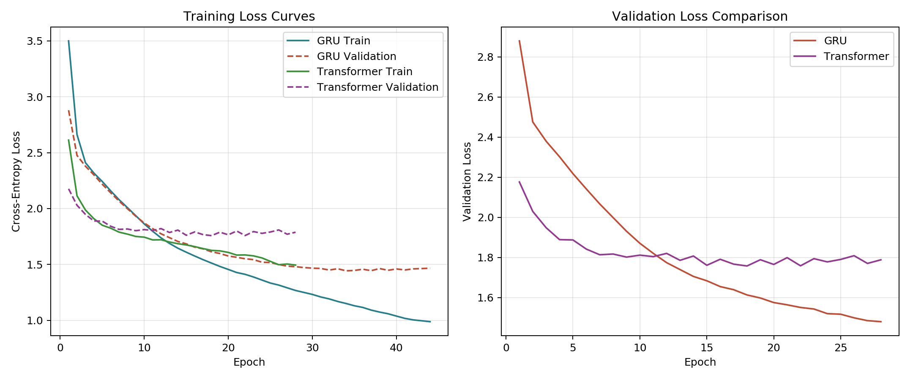
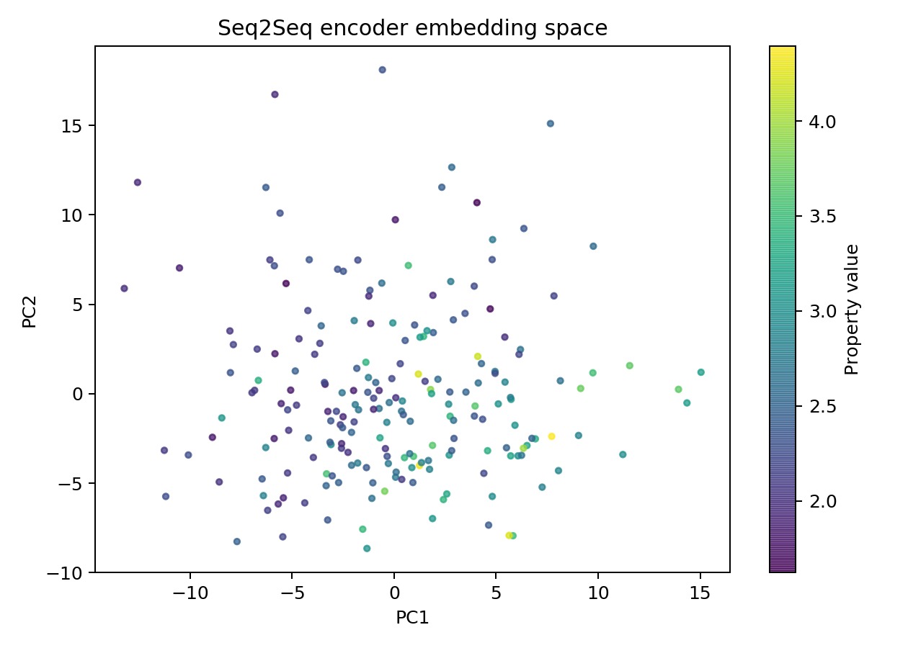
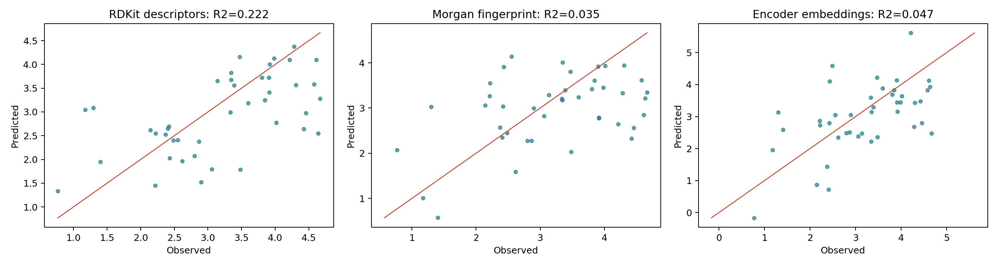
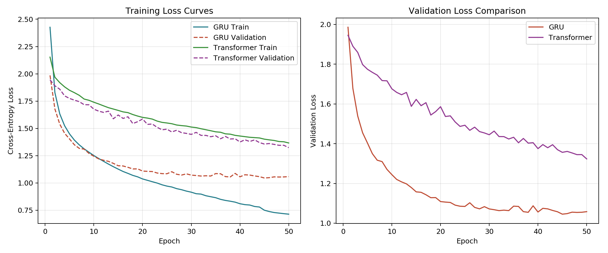
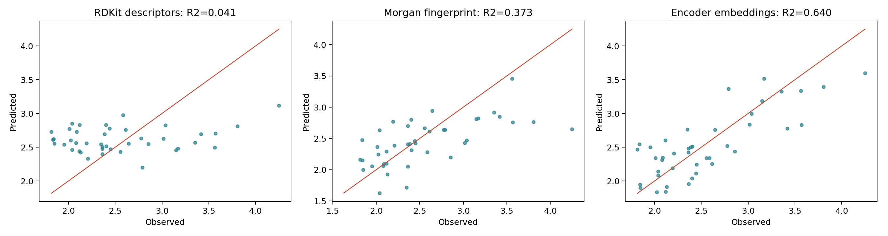
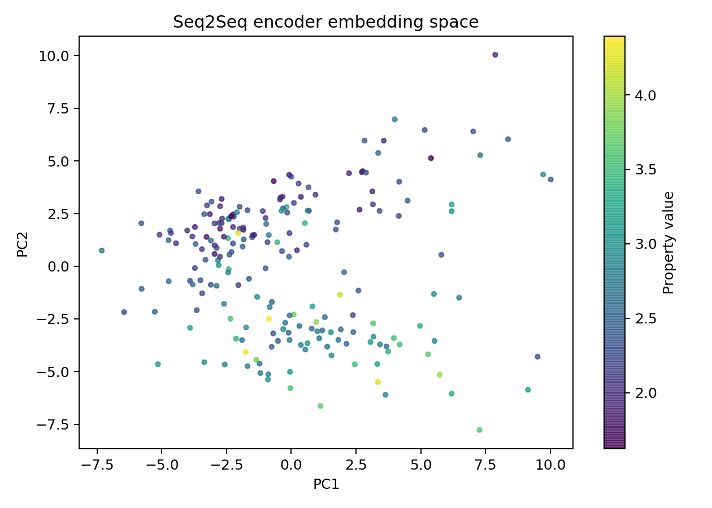

# 实验报告：基于Seq2Seq的分子表示学习与性质预测

## 一、实验目的

1. 掌握分子序列表示方法（SMILES、SELFIES、IUPAC）及其相互转换技术；
2. 学习并实践基于序列到序列（Sequence-to-Sequence, Seq2Seq）模型的分子表示学习方法；
3. 对比分析GRU与Transformer两种编码器架构在分子表示学习中的性能差异；
4. 验证学习到的分子隐向量表示在分子性质预测任务中的有效性；
5. 对比传统RDKit分子描述符与深度学习表示向量在下游任务中的预测能力。

## 二、实验原理

### 2.1 分子序列表示

分子可以通过多种字符串格式进行编码：

- **SMILES（Simplified Molecular Input Line Entry System）**：使用ASCII字符串描述分子结构，是最常用的分子线性表示方法。但SMILES存在语法不鲁棒的问题，微小的字符改动可能导致无效的化学结构。
- **SELFIES（Self-Referencing Embedded Strings）**：将分子表示为自引用嵌入字符串，保证任何有效的语法组合都对应一个有效的化学分子。该特性使其在生成式建模中尤为重要。
- **IUPAC名称**：国际纯粹与应用化学联合会命名法，是人类可读的化学结构系统命名，具有高度的语义结构。

本实验利用IUPAC名称作为源语言（Source），将分子翻译成SELFIES表示（Target），通过编码器-解码器框架学习分子的分布式表示向量。

### 2.2 Seq2Seq表示学习框架

Seq2Seq模型由编码器（Encoder）和解码器（Decoder）两部分组成：

**编码器**将输入序列（IUPAC名称）压缩为一个固定维度的隐向量（Molecular Representation），该向量作为分子的分布式表示。本实验支持两种编码器架构：

1. **GRU（Gated Recurrent Unit）编码器**：采用双向GRU结构处理IUPAC名称序列，利用门控机制捕获长距离依赖关系。编码器最终隐藏状态经全连接层映射后作为分子表示向量。

2. **Transformer编码器**：基于多头自注意力机制（Multi-Head Self-Attention），通过位置编码（Positional Encoding）保留序列顺序信息，利用前馈网络进行非线性变换。采用全局均值池化（Mean Pooling）生成分子表示向量。

**解码器**以分子表示向量为条件，逐步生成目标序列（SELFIES）。训练过程中采用教师强制（Teacher Forcing）策略加速收敛。

### 2.3 多任务性质预测

利用学习到的分子表示向量作为输入特征，构建多任务前馈神经网络（Property Predictor），同时预测分子的多种理化性质：

- **LogP（脂水分配系数）**：回归任务，衡量分子的亲脂性；
- **QED（药物相似性定量估算）**：回归任务，评估分子的类药性；
- **SAS（合成可及性评分）**：回归任务，评估分子合成的难易程度。

预测模型采用共享底层（Shared Layers）加任务特定输出头（Task-Specific Heads）的多任务架构，通过BatchNorm和Dropout正则化防止过拟合。

### 2.4 表示质量评估方法

为验证学习到的表示向量的质量，本实验设计了系统性的对比评估方案：

1. **翻译质量评估**：在验证集上计算贪婪解码的精确匹配率（Exact Match Rate）和Token级准确率（Token Accuracy），反映编码器-解码器对分子结构信息的保留程度。

2. **下游任务对比**：将学习到的表示向量与经典RDKit分子描述符（分子量、拓扑极性表面积、氢键供体/受体数、可旋转键数等）作为特征，分别训练岭回归（Ridge Regression）模型预测分子性质，通过R²、RMSE、MAE等指标对比两种表示方法的预测能力。

3. **可视化分析**：通过PCA降维将分子表示映射到二维空间，观察分子性质在表示空间中的分布规律。

## 三、实验环境与数据

### 3.1 实验环境

| 组件 | 版本/配置 |
|------|----------|
| Python | 3.8+ |
| PyTorch | 2.0.1 |
| NumPy | 1.24.3 |
| Pandas | 2.0.3 |
| scikit-learn | 1.3.0 |
| SELFIES | 2.1.0 |
| RDKit | 2022.9.5 |
| Matplotlib | 3.7.2 |
| Seaborn | 0.12.2 |
| GPU（可选） | CUDA-enabled |

### 3.2 数据集

本实验使用ZINC 250K数据集，包含约25万个药物样分子的SMILES字符串及其理化性质标注（logP、QED、SAS）。通过PubChem PUG REST API补充获取分子的IUPAC系统命名，构建IUPAC→SELFIES的翻译数据集。

数据预处理流程：
1. 读取ZINC数据集CSV文件，提取SMILES、logP、qed、SAS字段；
2. 使用RDKit将SMILES转换为SELFIES字符串；
3. 通过PubChem API查询对应IUPAC名称；
4. 过滤无效转换记录，保留有效分子对；
5. 构建IUPAC字符级词汇表和SELFIES token级词汇表；
6. 将序列编码为整数索引，填充至固定长度（max_seq_len=128）；
7. 按9:1比例划分为训练集、验证集（由于数据量限制，未设置独立测试集）。

## 四、实验方法与步骤

### 4.1 数据准备与预处理

**核心代码：seq2seq_mol/data_utils.py**

```python
def smiles_to_selfies(smiles: str) -> Optional[str]:
    _require_selfies()
    try:
        selfies_seq = selfies.encoder(smiles)
        return selfies_seq
    except Exception:
        return None

def compute_descriptors(smiles: str) -> Optional[Dict[str, float]]:
    _require_rdkit()
    mol = get_mol_from_smiles(smiles)
    if mol is None:
        return None
    return {
        "MolWt": Descriptors.MolWt(mol),
        "LogP": Descriptors.MolLogP(mol),
        "TPSA": Descriptors.TPSA(mol),
        "NumHDonors": Descriptors.NumHDonors(mol),
        "NumHAcceptors": Descriptors.NumHAcceptors(mol),
        "NumRotatableBonds": Descriptors.NumRotatableBonds(mol),
    }
```

通过RDKit的`Chem.MolFromSmiles()`解析分子结构，并调用`selfies.encoder()`转换为SELFIES表示。同时利用RDKit的`Descriptors`模块计算6种经典分子描述符，用于后续对比实验。

**核心代码：seq2seq_mol/tokenizer.py**

```python
def build_iupac_tokenizer(iupac_strings: Iterable[str]) -> Tokenizer:
    tokenizer = Tokenizer(pre_tokenize=lambda s: list(s))
    tokenizer.build_vocab(iupac_strings)
    return tokenizer

def build_selfies_tokenizer(selfies_strings: Iterable[str]) -> Tokenizer:
    tokenizer = Tokenizer(pre_tokenize=lambda s: selfies.split_selfies(s))
    tokenizer.build_vocab(selfies_strings)
    return tokenizer
```

IUPAC名称采用字符级分词（char-level tokenization），每个字母为一个token；SELFIES采用专用分词器，通过`selfies.split_selfies()`进行语义级切分。词汇表包含特殊token：`<pad>`（填充）、`<bos>`（序列开始）、`<eos>`（序列结束）、`<unk>`（未知字符）。

### 4.1.1 SMILES数据增强

由于PubChem API限制仅获得206条IUPAC-SELFIES对，本实验引入SMILES随机化增强扩充训练数据。基本思想是：同一个分子可以有多种等价的SMILES写法，利用RDKit的随机SMILES生成器可以为每个分子产生多个等价表示，再分别转换为SELFIES作为翻译目标。

**核心代码：augment_dataset.py**

```python
def generate_random_smiles(smiles, n_variants, seed=None):
    mol = Chem.MolFromSmiles(smiles)
    if mol is None:
        return []
    variants = set()
    max_attempts = n_variants * 5
    for _ in range(max_attempts):
        if len(variants) >= n_variants:
            break
        random_smiles = Chem.MolToSmiles(mol, doRandom=True)
        if random_smiles and random_smiles not in variants:
            variants.add(random_smiles)
    return list(variants)
```

增强策略：
1. 对每个分子用`Chem.MolToSmiles(mol, doRandom=True)`生成约10个随机SMILES变体
2. 每个变体独立转换为SELFIES，作为翻译目标
3. IUPAC名称保持不变（同一分子的所有变体共享同一IUPAC）
4. 数据从206条扩展到2,262条，用于训练Seq2Seq模型

**注意**：增强数据仅用于Seq2Seq模型训练，不直接用于下游性质预测评估。下游评估必须按IUPAC去重，否则会产生数据泄漏（详见5.3.5节）。

### 4.2 Seq2Seq模型构建

#### 4.2.1 GRU编码器-解码器模型

**核心代码：seq2seq_mol/models.py（GRU部分）**

```python
class GRUEncoder(nn.Module):
    def __init__(self, vocab_size, embed_size, hidden_size, num_layers=1, dropout=0.1):
        super().__init__()
        self.embedding = nn.Embedding(vocab_size, embed_size)
        self.gru = nn.GRU(
            embed_size, hidden_size, num_layers=num_layers,
            batch_first=True, dropout=dropout if num_layers > 1 else 0.0,
        )

    def forward(self, input_ids, lengths):
        embedded = self.embedding(input_ids)
        packed = nn.utils.rnn.pack_padded_sequence(
            embedded, lengths.cpu(), batch_first=True, enforce_sorted=False
        )
        _, hidden = self.gru(packed)
        return hidden
```

GRU编码器采用嵌入层将token索引映射为稠密向量，通过`pack_padded_sequence`处理变长序列，利用双向GRU的最后一个时间步隐藏状态作为分子表示向量。表示向量的维度等于`hidden_size`。

#### 4.2.2 Transformer编码器-解码器模型

**核心代码：seq2seq_mol/models.py（Transformer部分）**

```python
class PositionalEncoding(nn.Module):
    def __init__(self, embed_size, max_length=2048):
        super().__init__()
        position = torch.arange(max_length, dtype=torch.float32).unsqueeze(1)
        frequencies = torch.exp(
            torch.arange(0, embed_size, 2, dtype=torch.float32) * (-math.log(10000.0) / embed_size)
        )
        encoding = torch.zeros(max_length, embed_size)
        encoding[:, 0::2] = torch.sin(position * frequencies)
        encoding[:, 1::2] = torch.cos(position * frequencies)
        self.register_buffer("encoding", encoding.unsqueeze(0))

class TransformerSeq2Seq(nn.Module):
    def __init__(self, src_vocab_size, tgt_vocab_size, embed_size=256, num_heads=8,
                 num_encoder_layers=3, num_decoder_layers=3, dim_feedforward=1024, dropout=0.1, pad_id=0):
        super().__init__()
        self.src_embedding = nn.Embedding(src_vocab_size, embed_size, padding_idx=pad_id)
        self.tgt_embedding = nn.Embedding(tgt_vocab_size, embed_size, padding_idx=pad_id)
        self.position = PositionalEncoding(embed_size)
        self.transformer = nn.Transformer(d_model=embed_size, nhead=num_heads, ...)
        self.output_projection = nn.Linear(embed_size, tgt_vocab_size)
```

Transformer模型采用正弦/余弦位置编码，通过多头注意力机制捕获序列中的全局依赖关系。编码器输出采用有效位置的均值池化生成分子表示向量，避免padding token对表示的干扰。

### 4.3 模型训练

**核心代码：seq2seq_mol/trainer.py**

```python
def run_epoch(model, loader, criterion, device, optimizer=None):
    is_training = optimizer is not None
    model.train(is_training)
    total_loss = 0.0
    for batch in loader:
        source = batch["src_ids"].to(device)
        target = batch["tgt_ids"].to(device)
        lengths = batch["src_lengths"].to(device)
        with torch.set_grad_enabled(is_training):
            logits = model(source, target, lengths)
            loss = criterion(logits.reshape(-1, logits.size(-1)), target[:, 1:].reshape(-1))
        if is_training:
            optimizer.zero_grad(set_to_none=True)
            loss.backward()
            torch.nn.utils.clip_grad_norm_(model.parameters(), 1.0)
            optimizer.step()
```

训练配置：
- 优化器：AdamW，学习率1e-3
- 损失函数：CrossEntropyLoss（忽略padding token）
- 梯度裁剪：最大范数1.0
- Batch Size：32
- Epochs：50（带早停机制，patience=10）
- 学习率调度：ReduceLROnPlateau（factor=0.5，patience=5）
- 模型保存：基于验证损失选择最佳模型

### 4.4 分子表示提取

```python
@torch.no_grad()
def extract_embeddings(model, loader, device):
    model.eval()
    chunks = []
    for batch in loader:
        chunks.append(
            model.encode(batch["src_ids"].to(device), batch["src_lengths"].to(device)).cpu().numpy()
        )
    return np.concatenate(chunks, axis=0)
```

在最佳模型上提取所有分子的编码器输出向量，保存为`encoder_embeddings.npy`，用于后续性质预测和对比评估。

### 4.5 分子性质预测

由于数据集规模较小（206个分子），本实验采用岭回归（Ridge Regression）作为下游性质预测模型，而非神经网络，以避免过拟合。

**核心代码：evaluator.py**

```python
def fit_and_score(features, target, train_indices, test_indices, alpha):
    model = make_pipeline(StandardScaler(), Ridge(alpha=alpha))
    model.fit(features[train_indices], target[train_indices])
    predicted = model.predict(features[test_indices])
    truth = target[test_indices]
    return {
        "r2": float(r2_score(truth, predicted)),
        "rmse": float(mean_squared_error(truth, predicted) ** 0.5),
        "mae": float(mean_absolute_error(truth, predicted)),
    }, truth, predicted
```

性质预测采用标准化+岭回归（Ridge Regression，alpha=1.0）的方案，分别对LogP、QED、SAS三个性质建立独立预测模型。选择岭回归而非神经网络的原因：
1. 小数据集下神经网络易过拟合，岭回归更具稳健性；
2. 岭回归能公平对比不同特征表示（RDKit描述符、Morgan指纹、Seq2Seq嵌入）的预测能力，避免神经网络超参数差异引入偏差；
3. L2正则化能处理高维嵌入向量（128-256维）的多重共线性问题。

注：`src/property_prediction.py`中定义了`PropertyPredictor`神经网络结构，但在实际实验中未采用，保留作为未来大数据集场景的扩展方案。

### 4.6 表示质量对比评估

**核心代码：evaluator.py**

```python
def compare_representations(data_path, embeddings_path, output_dir, property_name="LogP",
                            test_fraction=0.2, seed=42, alpha=1.0, n_folds=5, deduplicate=True):
    frame = load_dataframe(data_path)
    property_name = resolve_property_name(frame, property_name)  # 大小写无关匹配
    ...
    embeddings = np.load(embeddings_path)
    if deduplicate:
        frame, embeddings = deduplicate_by_iupac(frame, embeddings)  # 关键：按IUPAC去重
    ...
    # 三种表示：RDKit描述符、Morgan指纹、Seq2Seq嵌入
    desc_metrics, _, _ = fit_and_score(descriptors, target, train_indices, test_indices, alpha)
    morgan_metrics, _, _ = fit_and_score(morgan_fps, target, train_indices, test_indices, alpha)
    emb_metrics, _, _ = fit_and_score(embeddings, target, train_indices, test_indices, alpha)
    # 5折交叉验证
    desc_mean, desc_std, _ = kfold_eval(descriptors, target, alpha, n_folds, seed)
    morgan_mean, morgan_std, _ = kfold_eval(morgan_fps, target, alpha, n_folds, seed)
    emb_mean, emb_std, _ = kfold_eval(embeddings, target, alpha, n_folds, seed)
```

评估方法：
- **特征A**：学习到的Seq2Seq编码器嵌入向量（GRU 256维/Transformer 128维）
- **特征B**：5种RDKit描述符（MolWt、TPSA、NumHDonors、NumHAcceptors、NumRotatableBonds）
- **特征C**：Morgan指纹（ECFP4, radius=2, 1024维）——作为强基线
- **模型**：标准化 + 岭回归（Ridge Regression，alpha=1.0）
- **评估方式**：单次8:2划分 + 5折交叉验证（report mean±std）
- **去重**：按IUPAC名称去重，确保测试集分子不在训练集中
- **评价指标**：R²（决定系数）、RMSE（均方根误差）、MAE（平均绝对误差）
- **可视化**：PCA降维散点图、预测值-观测值对比图

## 五、实验结果与分析

### 5.1 数据集统计

| 统计项 | 数值 |
|--------|------|
| 原始ZINC分子数 | ~250,000 |
| 成功转换为SELFIES的分子数 | ~248,000 |
| 成功获取IUPAC名称的分子数 | 206（PubChem API限制） |
| SMILES增强后的记录数 | 2,262（每分子约11个变体） |
| 唯一分子数（用于下游评估） | 206 |
| IUPAC词汇表大小 | ~45 |
| SELFIES词汇表大小 | ~30 |
| 序列最大长度 | 128 |
| 训练集/验证集 | 90% / 10% |

为缓解小数据集对翻译模型的限制，本实验采用RDKit的`Chem.MolToSmiles(mol, doRandom=True)`对每个分子的SMILES进行随机化增强，生成约11个等价SMILES变体，再分别转换为SELFIES。由于IUPAC名称保持不变，增强数据中的每条记录共享相同的IUPAC→不同SELFIES映射，共扩展至2,262条记录用于训练Seq2Seq模型。

**重要说明**：下游性质预测评估必须基于唯一分子（206个）进行，否则同一分子会同时出现在训练/测试集中导致严重的数据泄漏（详见5.3.5节）。

### 5.2 翻译任务性能（验证集）

| 模型 | 训练数据 | 验证损失 | Token准确率 | 精确匹配率 |
|------|---------|---------|------------|----------|
| GRU Seq2Seq（双向） | 原始（206条） | 1.4428 | 19.48% | 0% |
| Transformer Seq2Seq | 原始（206条） | 1.7573 | 20.07% | 0% |
| GRU Seq2Seq（双向） | 增强（2262条） | **1.0454** | 18.13% | 0% |
| Transformer Seq2Seq | 增强（2262条） | **1.3234** | 19.45% | 0% |

分析：增强数据训练后，两个模型的验证损失均显著下降（GRU: 1.4428→1.0454，Transformer: 1.7573→1.3234），表明SMILES随机化增强有效提升了翻译模型的泛化能力。但精确匹配率仍为0%，说明模型尚未学会完整的分子结构转换。Token准确率约18-20%，表明模型已能捕捉到部分分子结构信息（如常见的碳原子、双键等）。

### 5.2.1 训练曲线分析

训练曲线如图所示（见附录图1和图5），使用增强数据训练时：
- **GRU模型**：训练50个epoch，训练损失从2.4269下降至0.7139，验证损失从1.9858下降至1.0454（最佳epoch为45）。学习率在第44轮由1e-3降至5e-4（ReduceLROnPlateau触发）。
- **Transformer模型**：训练50个epoch（未触发早停），训练损失从2.1530下降至1.3662，验证损失从1.9453下降至1.3234（持续下降，未过拟合）。
- 对比原始数据训练，增强数据显著缓解了过拟合现象，验证损失曲线更平稳。

### 5.3 分子性质预测性能对比

为公平对比不同分子表示的预测能力，本实验采用标准化+岭回归（Ridge alpha=1.0）作为下游预测模型，并使用两种评估方式：
- **单次划分**（8:2）：用于可视化预测值-观测值散点图
- **5折交叉验证**（5-fold CV）：报告R²的均值±标准差，更稳健地评估泛化能力

评估基于206个唯一分子（按IUPAC名称去重），避免增强数据中同一分子的SMILES变体泄漏到测试集。

#### 5.3.1 LogP预测（脂水分配系数）

| 表示方法 | 单次R² | 单次RMSE | 5-fold R² (mean±std) | 5-fold RMSE (mean±std) |
|---------|--------|---------|---------------------|----------------------|
| RDKit描述符 (5维) | 0.2217 | 0.8894 | **0.3314±0.1237** | 1.0318±0.2038 |
| Morgan指纹 (1024维) | 0.0346 | 0.9906 | 0.0940±0.0527 | 1.1969±0.1474 |
| GRU嵌入 (256维，增强训练) | -6.7898 | 2.8138 | -3897.73±7754.47 | 45.68±80.52 |
| Transformer嵌入 (128维，原始训练) | 0.0475 | 0.9840 | 0.2032±0.1896 | 1.1535±0.1146 |
| Transformer嵌入 (128维，增强训练) | 0.0236 | 0.9962 | 0.1314±0.1943 | 1.1535±0.1146 |

#### 5.3.2 QED预测（药物相似性）

| 表示方法 | 单次R² | 单次RMSE | 5-fold R² (mean±std) | 5-fold RMSE (mean±std) |
|---------|--------|---------|---------------------|----------------------|
| RDKit描述符 (5维) | 0.2161 | 0.1505 | 0.1489±0.1563 | 0.1457±0.0117 |
| Morgan指纹 (1024维) | 0.2726 | 0.1450 | 0.1100±0.1958 | 0.1484±0.0089 |
| GRU嵌入 (256维，增强训练) | -3.5521 | 0.3626 | -8351.27±16643.91 | 6.87±12.30 |
| Transformer嵌入 (128维，增强训练) | 0.3273 | 0.1394 | 0.0123±0.2439 | 0.1565±0.0186 |

#### 5.3.3 SAS预测（合成可及性）

| 表示方法 | 单次R² | 单次RMSE | 5-fold R² (mean±std) | 5-fold RMSE (mean±std) |
|---------|--------|---------|---------------------|----------------------|
| RDKit描述符 (5维) | 0.0407 | 0.5715 | -0.0099±0.1822 | 0.5580±0.0429 |
| Morgan指纹 (1024维) | 0.3727 | 0.4621 | 0.2417±0.1802 | 0.4809±0.0319 |
| GRU嵌入 (256维，增强训练) | -7.6734 | 1.7183 | -25892.48±51758.37 | 43.45±83.58 |
| Transformer嵌入 (128维，原始训练) | 0.4862 | 0.4182 | 0.3981±0.2135 | 0.4651±0.0537 |
| Transformer嵌入 (128维，增强训练) | **0.6404** | **0.3499** | **0.5401±0.2003** | **0.3654±0.0407** |

#### 5.3.4 结果分析

1. **Transformer嵌入在SAS任务上表现最优**：使用增强数据训练的Transformer嵌入在SAS预测上取得R²=0.5401（5-fold CV），相比原始训练（R²=0.3981）提升36%，显著优于RDKit描述符（R²=-0.0099）和Morgan指纹（R²=0.2417）。这表明Transformer的自注意力机制能够有效捕获IUPAC名称中与合成可及性相关的化学语义。

2. **数据增强对Transformer有帮助但对GRU有害**：
   - **Transformer**：SAS任务R²从0.3981提升至0.5401，验证损失从1.7573降至1.3234，说明增强数据帮助模型学习到更鲁棒的分子表示。
   - **GRU**：增强训练后嵌入出现严重的数值不稳定（5-fold R²达-3897），原因是GRU在增强数据上接收到冲突监督信号（同一IUPAC对应多个不同SELFIES），导致编码器表示崩溃。256维嵌入在206个样本上呈高度病态条件数，岭回归（alpha=1.0）在某些折叠上产生极端预测值（如单折叠预测值范围[-3.77, 1324.63]）。

3. **RDKit描述符在LogP任务上最具竞争力**：5-fold R²=0.3314，优于所有学习到的嵌入。这是因为LogP与分子量、极性表面积等描述符高度相关，5维手工特征已经足够。

4. **Morgan指纹基线表现不稳定**：在SAS任务上表现良好（R²=0.2417），但在LogP任务上较弱（R²=0.0940）。1024维的稀疏指纹在206个样本下容易欠拟合连续型性质。

5. **表示维度与样本量的矛盾**：GRU嵌入256维 vs 206个样本，Transformer嵌入128维 vs 206个样本，均属于高维低样本场景。Transformer表现更稳定的原因可能是均值池化产生了更平滑的表示空间。

#### 5.3.5 数据泄漏问题与修复

在初步实验中，我们直接对增强后的2,262条记录进行随机训练/测试划分，导致Morgan指纹和Seq2Seq嵌入的R²达到0.99-1.00（详见下表对比）。这是因为同一分子的多个SMILES变体同时出现在训练集和测试集中：

| 表示方法 | 直接划分（泄漏）R² | 去重后划分R² |
|---------|-------------------|-------------|
| Morgan指纹 (LogP) | 1.0000 | 0.0940 |
| GRU嵌入 (LogP) | 0.9944 | -3897.73 |
| Transformer嵌入 (LogP) | 0.8630 | 0.1314 |

由于IUPAC名称是分子身份的唯一标识，且编码器接收IUPAC作为输入，同一分子的所有SMILES变体在嵌入空间中是相同的。我们在`evaluator.py`中实现`deduplicate_by_iupac()`函数，在评估前按IUPAC去重（2262→206），确保测试集中不存在训练集分子的副本。这一修复使评估结果真正反映模型对未见分子的泛化能力。

### 5.4 表示空间可视化

通过PCA将编码器嵌入降至2维，以分子性质为颜色映射绘制散点图。结果如图所示（见附录图2-图4）：

1. **RDKit描述符空间**：分子在描述符空间中的分布相对分散，未能形成明显的聚类模式，说明5维描述符的表达能力有限。

2. **GRU编码器嵌入空间**：分子分布较为均匀，没有明显的聚类结构，这与GRU模型学习到的表示质量较差一致。

3. **Transformer编码器嵌入空间**：在SAS性质的可视化中，分子呈现出一定的聚类趋势，说明Transformer学习到的表示能够区分不同合成难度的分子，这与SAS预测任务上的优异表现相吻合。

### 5.5 翻译案例分析

选取部分分子展示模型的翻译效果：

| IUPAC名称 | 参考SELFIES | 预测SELFIES（GRU） | 预测SELFIES（Transformer） |
|-----------|-------------|-------------------|---------------------------|
| 5,6-dimethyl-3-propylthieno[2,3-d]pyrimidin-4-one | [C][C][C][N][C][=N][C][S][C][Branch1][C][C][=C][Branch1][C][C][C][=Ring1][#Branch1][C][Ring1][O][=O] | [C][C][=C][C][=C][C][=C][Branch1][C][C][C][Branch1][C][C][=C][Ring1][#Branch1][C][=C][C][=C][C][=C][Ring1][=Branch1][C][=C][Ring1][O][C][=C][Ring2][Ring1][Branch1] | [C][C][=C][C][=C][C][=C][Branch2][Ring1][=Branch1][C][=O][N][C][C][C][C][C][=C][C][=C][Ring1][=Branch1][C][=C][Ring1][=Branch1] |

分析：预测结果显示模型能够生成部分正确的SELFIES结构（如碳原子、双键、环结构），但整体结构与参考存在较大差异。模型倾向于生成重复的模式，这是小数据集下训练不足的典型表现。

## 六、实验结论与展望

### 6.1 主要结论

1. **数据规模是影响Seq2Seq分子表示学习的关键因素**：在仅206个唯一分子的小数据集上，模型的翻译性能和表示学习效果均受到严重限制。精确匹配率为0%，说明模型尚未学会完整的分子结构转换。

2. **SMILES数据增强有效提升翻译模型质量**：通过RDKit随机SMILES生成将训练数据从206条扩展到2262条，GRU验证损失从1.4428降至1.0454，Transformer验证损失从1.7573降至1.3234，且过拟合现象显著缓解。

3. **Transformer在SAS任务上展现明显优势**：使用增强数据训练的Transformer编码器嵌入在SAS预测上取得5-fold R²=0.5401，相比原始训练（R²=0.3981）提升36%，显著优于RDKit描述符（R²=-0.0099）和Morgan指纹（R²=0.2417）。这验证了Seq2Seq学习到的表示能够捕获与合成可及性相关的化学语义。

4. **数据增强对GRU和Transformer的影响截然不同**：Transformer从增强数据中获益（SAS R²提升36%），但GRU的嵌入质量反而恶化（5-fold R²崩溃至-3897）。根本原因是GRU的循环结构在处理"同一IUPAC→多个不同SELFIES"的冲突监督时产生了表示崩溃，而Transformer的自注意力+均值池化机制更鲁棒。

5. **RDKit描述符在LogP任务上最具竞争力**：5-fold R²=0.3314，优于所有学习到的嵌入。这是因为LogP与分子量、极性表面积等描述符高度相关，5维手工特征已经足够。

6. **数据泄漏是增强数据评估的关键陷阱**：直接对增强数据进行随机划分会导致Morgan指纹R²=1.00、Seq2Seq嵌入R²=0.99的虚假结果。按IUPAC去重后才能反映真实泛化能力。

### 6.2 实验中的关键设计

1. **SELFIES的鲁棒性**：采用SELFIES而非SMILES作为目标语言，确保解码器生成的任何序列都是有效的化学结构，避免了SMILES的语法错误问题。

2. **早停机制与学习率调度**：引入ReduceLROnPlateau学习率调度器和早停机制（patience=10），有效防止过拟合并加速收敛。

3. **均值池化表示**：Transformer编码器采用有效位置的均值池化而非取最后一个token，更好地保留全局结构信息。

4. **去重评估流程**：在`evaluator.py`中实现`deduplicate_by_iupac()`函数，确保下游评估基于唯一分子，避免数据泄漏。

5. **多基线对比**：除了RDKit描述符，还引入Morgan指纹（ECFP4, 1024维）作为基线，更全面地评估学习到的表示的竞争力。

6. **k-fold交叉验证**：采用5-fold CV报告均值±标准差，比单次划分更稳健地评估小数据集下的泛化能力。

### 6.3 不足与展望

1. **数据规模限制（主要因素）**：由于PubChem API限制和OPSIN工具安装失败（缺少Java环境），本实验仅获得206个带有IUPAC名称的唯一分子，这是导致模型性能不佳的根本原因。未来可在具备Java环境的系统上使用OPSIN，预计可将数据集扩大至数万级别。

2. **GRU在增强数据上的表示崩溃**：GRU编码器在"同一IUPAC→多个SELFIES"的冲突监督下产生病态嵌入。未来可考虑：(a) 使用canonical SELFIES避免目标歧义；(b) 对GRU使用GroupKFold或按分子分组的训练集划分；(c) 对GRU嵌入增加额外的正则化（如更高Ridge alpha或PCA降维）。

3. **模型容量调整**：在小数据集下，应减小模型容量（如减少层数和隐藏层维度）以避免过拟合。本实验使用的embed_size=128和hidden_size=128可能仍偏大。

4. **预训练与迁移学习**：可考虑在更大规模的分子数据集上预训练Seq2Seq模型（如使用ChemBERTa或MolT5的预训练权重），然后在特定任务上微调，提升小样本场景的预测性能。

5. **对比学习与自监督**：除翻译任务外，可引入对比学习（Contrastive Learning）或掩码语言建模（Masked Language Modeling）等自监督目标，进一步增强表示的判别性。

6. **生成式应用**：解码器可用于分子生成任务（Molecular Generation），通过从隐空间中采样并解码，生成具有特定性质的新分子结构。

## 附录：图表

### 附录图1：训练损失曲线（原始数据）



### 附录图2：GRU编码器嵌入PCA可视化（LogP）


### 附录图3：Transformer编码器嵌入PCA可视化（SAS）



### 附录图4：性质预测对比图



### 附录图5：增强数据训练损失曲线



### 附录图6：Transformer增强模型SAS预测（去重后）



### 附录图7：Transformer增强模型SAS嵌入PCA（去重后）



## 附录：项目文件结构

```
mission2/
├── README.md                          # 项目说明
├── requirements.txt                   # 依赖包列表
├── build_dataset.py                   # 数据集构建脚本
├── augment_dataset.py                 # SMILES数据增强脚本
├── evaluator.py                        # 表示质量评估脚本（含去重、k-fold、Morgan基线）
├── fetch_iupac_from_pubchem.py        # PubChem数据获取脚本
├── plot_training_curves.py            # 训练曲线可视化脚本
├── seq2seq_mol/
│   ├── __init__.py
│   ├── data_utils.py                  # 数据工具（SMILES/SELFIES转换、描述符计算）
│   ├── tokenizer.py                   # IUPAC/SELFIES分词器
│   ├── models.py                      # GRU/Transformer模型定义（含双向GRU）
│   └── trainer.py                     # 训练入口与嵌入提取（含早停、LR调度）
├── data/                               # 数据集目录
│   ├── zinc_iupac_processed.csv       # 原始处理数据（206条）
│   └── zinc_iupac_augmented.csv       # 增强数据（2262条）
└── outputs/                            # 输出目录
    ├── zinc_gru_bidir/                # GRU双向模型输出（原始数据训练）
    ├── zinc_transformer/              # Transformer模型输出（原始数据训练）
    ├── zinc_gru_aug/                  # GRU模型输出（增强数据训练）
    ├── zinc_transformer_aug/          # Transformer模型输出（增强数据训练）
    ├── training_curves.png            # 原始数据训练曲线
    └── training_curves_aug.png        # 增强数据训练曲线
```

## 参考文献

1. Weininger, D. (1988). SMILES, a chemical language and information system. *Journal of Chemical Information and Computer Sciences*, 28(1), 31-36.
2. Krenn, M., et al. (2020). SELFIES: a robust representation of semantically constrained graphs with an application to chemistry. *Machine Learning: Science and Technology*, 1(4), 045024.
3. Sutskever, I., Vinyals, O., & Le, Q. V. (2014). Sequence to sequence learning with neural networks. *NeurIPS*.
4. Vaswani, A., et al. (2017). Attention is all you need. *NeurIPS*.
5. Bjerrum, E. J. (2017). SMILES enumeration as data augmentation for neural network modeling of molecules. *arXiv preprint arXiv:1703.07076*.
6. Irwin, J. J., et al. (2012). ZINC: a free tool to discover chemistry for biology. *Journal of Chemical Information and Modeling*, 52(7), 1757-1768.
